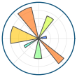

# Google Summer of Code

| [Sub organizations](#sub-organizations) | [IDEAS LIST][IL] | [Student guides][CONTRIBUTING]  |

[NumFOCUS][] will be applying again as an umbrella mentoring organization
for [Google Summer of Code 2021][GSoC]. [NumFOCUS][] supports and
promotes world-class, innovative, open source scientific software.

[NumFOCUS][]  is committed to promoting and sustaining a professional and ethical community. Our [Code of Conduct](https://numfocus.org/code-of-conduct) is our effort to uphold these values and it provides a guideline and some of the tools and resources necessary to achieve this.

[Google Summer of Code][GSoC] is an annual open source internship program
sponsored by Google. This repository contains information specific to NumFOCUS'
participation in GSoC. For general information about the competition, including
this year's application timeline and key phases involved, please see the [GSoC
website](https://summerofcode.withgoogle.com/how-it-works/)

<!--
This Git repository stores information about NumFOCUS' participation in
Google Summer of Code 2021 program and previous editions.
-->

This Git repository stores information about NumFOCUS'
application for Google Summer of Code in the current and previous years.

<!-- markdown-toc start - Don't edit this section. Run M-x markdown-toc-generate-toc again -->
**Table of Contents**

- [Students](#students)
- [Sub Organizations](#sub-organizations)
- [Organizations Confirmed Under NumFOCUS Umbrella](#organizations-confirmed-under-numfocus-umbrella)
- [NumFOCUS Projects](#numfocus-projects)
    - [Fiscally Sponsored Projects GSoC Status](#fiscally-sponsored-projects-gsoc-status)
    - [Affiliated Projects GSoC Status](#affiliated-projects-gsoc-status)
    - [Other Projects GSoC Status](#other-projects-gsoc-status)
- [About GSoC](#about-gsoc)

<!-- markdown-toc end -->

## Students

NumFOCUS is participating as a umbrella organization. This means that
you will need to identify a specific project to apply to under the
NumFOCUS umbrella. (Projects are listed below.)

Read [this document][CONTRIBUTING] to learn how to apply for the
GSoC program with NumFOCUS. Please also check out our [ideas list][IL].

For any questions, please open an issue in our [issue tracker][issues]
or send a email to gsoc@numfocus.org, our mailing list address.
Please also consider subscribing to the mailing list at
https://groups.google.com/a/numfocus.org/forum/#!forum/gsoc.

## Sub Organizations

If you want to participate as a sub organization of NumFOCUS please read
this [guide](CONTRIBUTING-mentors.md).

## Organizations Confirmed Under NumFOCUS Umbrella

<!--
The list should contain for each project.
 - A short description
 - link to their website
 - link to ideas page
 - link how to best contact them
 - link to beginners guide
-->

In alphabetic order.

<table>
  <tr>
    <td>
      
    </td>
    <td>
       <h1>AiiDA</h1>
       

        AiiDA is a python framework for managing computational science workflows, with roots in computational materials science. It helps researchers manage large numbers of simulations (1k, 10k, 100k, ...) and complex workflows involving multiple executables. At the same time, it records the provenance of the entire simulation pipeline with the aim to make it fully reproducible.
       

       

         <a href="http://www.aiida.net">Website</a> | <a href="https://github.com/aiidateam/aiida-core/wiki/GSoC-2021-Projects">Ideas List</a> | <a href="https://github.com/aiidateam/aiida-core/discussions/4702"> Contact </a> | <a href="https://github.com/aiidateam/aiida-core">Source Code</a>
       

    </td>
  </tr>

  <tr>
    <td>
      
    </td>
    <td>
       <h1>ArviZ</h1>
       

        ArviZ is a Python package for exploratory analysis of Bayesian models. Includes functions for posterior analysis, sample diagnostics, model checking, and comparison. The goal is to provide backend-agnostic tools for diagnostics and visualizations of Bayesian inference in Python, by first converting inference data into xarray objects.
       

       

         <a href="https://arviz-devs.github.io/arviz/">Website</a> | <a href="https://github.com/arviz-devs/arviz/wiki/GSoC-2021-projects">Ideas List</a> | <a href="https://gitter.im/arviz-devs/community"> Contact (Gitter) </a> | <a href="https://github.com/arviz-devs/arviz">Source Code</a>
       

    </td>
  </tr>
  <!--
  <tr>
  <td>
      
    </td>
    <td>
       <h1>Bokeh</h1>
       

        Bokeh is an interactive visualization library for modern web browsers. It provides elegant, concise construction of versatile graphics, and affords high-performance interactivity over large or streaming datasets. Bokeh can help anyone who would like to quickly and easily make interactive plots, dashboards, and data applications.
       

       

         <a href="https://docs.bokeh.org/en/latest/">Website (docs)</a> | <a href="https://github.com/bokeh/bokeh/wiki/GSOC-2020-Ideas-Page">Ideas List</a> | <a href="https://discourse.bokeh.org/c/development/7"> Contact (Discourse) </a> | <a href="https://github.com/bokeh/bokeh">Source Code</a>
       

    </td>
  </tr>
  
   <tr>
    <td>
      
    </td>
    <td>
       <h1>Cantera</h1>
       

        Cantera is a library to solve problems involving thermodynamics, chemical kinetics, and
        transport.
       

       

         <a href="https://cantera.org/">Website</a>  | <a href="https://github.com/Cantera/cantera/wiki/GSoC-2020-Ideas">Ideas List</a> | <a href="https://groups.google.com/forum/#!forum/cantera-users">Mailing List</a> | <a href="https://github.com/Cantera/cantera">Source Code</a>
       

    </td>
  </tr>
  
  <tr>
    <td>
      
    </td>
    <td>
       <h1>Clawpack</h1>
       

        Clawpack (“Conservation Laws Package”) is a collection of finite volume methods for linear and nonlinear hyperbolic systems of conservation laws.
       

       

       <a href="https://www.clawpack.org">Website</a> | <a href="https://github.com/clawpack/clawpack/wiki/Google-Summer-of-Code-2020">Ideas List</a> | <a href="https://join.slack.com/t/clawpack/shared_invite/enQtNTAwMjQxNTk5NjY5LTJjMzJkMzhjZTQ0NzQ2Y2JkZTg3YWFhN2M4ZjIwMDA3YWNiNDM5NTA2NGNlZDA2YzlmNDkwMzA5ZGFkODgyMzc"> Slack </a> | <a href="https://github.com/clawpack">Source Code</a>
       

    </td>
  </tr>

<tr>
    <td>
      
    </td>
    <td>
       <h1>Conda Forge</h1>
       

        A community led collection of recipes, build infrastructure and distributions for the conda package manager.
       

       

         <a href="https://conda-forge.org">Website</a>  | <a href="https://github.com/conda-forge/blog/blob/gh-pages/_posts/2020-02-04-GSoC.md">Ideas List</a> | <a href="https://gitter.im/conda-forge/conda-forge.github.io"> Gitter </a> | <a href="https://github.com/conda-forge">Source Code</a>
       

    </td>
  </tr>
-->

  <tr>
    <td>
      
    </td>
    <td>
       <h1>CB-Geo MPM</h1>
       

          CB-Geo MPM is an HPC-enabled Material Point Method solver for large-deformation modeling. It supports isoparametric elements to model complex geometries and creates photo-realistic rendering.
       

       

       <a href="https://www.cb-geo.com/research/mpm/">Website</a> | <a href="https://github.com/cb-geo/mpm/issues/704#issue-796189505">Ideas List</a> | <a href="https://cb-geo.discourse.group">Discourse</a> | <a href="https://github.com/cb-geo/mpm">Source Code</a>
       

    </td>
  </tr>

<tr>
    <td>
      
    </td>
    <td>
       <h1>Colour</h1>
       

          <a href="https://github.com/colour-science/colour">Colour</a> is an
          open-source <a href="https://www.python.org/">Python</a> package
          providing a comprehensive number of algorithms and datasets for
          colour science.
       

        

          It is freely available under the
          <a href="https://opensource.org/licenses/BSD-3-Clause">New BSD License</a>
          terms.
       

       

       <a href="https://www.colour-science.org/">Website</a> | <a href="">Ideas List</a> | <a href="colour-developers@colour-science.org">Contact</a> | <a href="https://github.com/colour-science/colour">Source Code</a>
       

    </td>
  </tr>

  <tr>
    <td>
      
    </td>
    <td>
       <h1>CuPy</h1>
       

         CuPy is an open-source matrix library accelerated with NVIDIA CUDA. It also uses CUDA-related libraries including cuBLAS, cuDNN, cuRand, cuSolver, cuSPARSE, cuFFT and NCCL to make full use of the GPU architecture.
       

       <a href="https://cupy.dev">Website</a> | <a href="https://github.com/cupy/cupy/wiki/GSoC-2021-Project-Ideas">Ideas List</a> | <a href="https://groups.google.com/forum/#!forum/cupy">Contact</a> | <a href="https://github.com/cupy/cupy">Source Code</a>
       

    </td>
  </tr>
<!--

  <tr>
   <td>
     
   </td>
   <td>
      <h1>Data Retriever</h1>
      

        The Data Retriever is a package manager for data. It downloads, cleans,
        and stores publicly available data, so that analysts spend less time
        cleaning and managing data, and more time analyzing it.
      

      

        <a href="http://www.data-retriever.org/">Website</a>  | <a href="https://github.com/weecology/retriever/wiki/GSoC-2020-Project-Ideas"> Ideas List</a> | <a href="https://gitter.im/weecology/retriever"> Contact (Gitter) | <a href="https://github.com/weecology/retriever">Source Code</a>
      

   </td>
 </tr>
 
  <tr>
   <td>
     
   </td>
   <td>
      <h1>Econ-Ark</h1>
      

        The aim of the Econ-ARK project is to make it easier for social scientists to do ‘structural modeling’ of economic choice behavior by providing a well-documented, open source codebase containing the core techniques in a way that can be relatively easily adapted to address many different questions in both macro- and microeconomics. ‘Structural’ modeling of economic choices aims to identify the logic or reasons behind observed behavior, rather than just describing that behavior statistically.
      

      

        <a href="https://econ-ark.org">Website</a>  | <a href="https://github.com/econ-ark/OverARK/wiki/GSoC-2020-Project-Ideas"> Ideas List</a> | <a href=""> Contact | <a href="https://github.com/econ-ark/HARK">Source Code</a>
      

   </td>
 </tr>

 <tr>
   <td>
     
   </td>
   <td>
      <h1>JuMP</h1>
      

        JuMP is a modeling language and supporting packages for mathematical optimization in Julia.
        JuMP makes it easy to formulate and solve linear programming, semidefinite programming, integer
        programming, convex optimization, constrained nonlinear optimization, and related classes of
        optimization problems.
      

      

        <a href="https://jump.dev/">Website</a> | <a href="https://gitter.im/JuliaOpt/JuMP-dev">Developers chat on Gitter</a> | <a href ="https://github.com/jump-dev/GSOC2020/blob/master/ideas-list.md">Ideas Page</a> | <a href="https://github.com/FEniCS">Source Code</a>
      

   </td>
 </tr>
-->
  <tr>
   <td>
     
   </td>
   <td>
      <h1>equadratures</h1>
      

        equadratures is an open-source library for uncertainty quantification, machine learning, optimisation, numerical integration and dimension reduction – all using orthogonal polynomials.
      

      

        <a href="https://equadratures.org">Website</a>  | <a href="https://github.com/Effective-Quadratures/equadratures/wiki/GSoC-2021-Projects"> Ideas List</a> | <a href="https://discourse.equadratures.org/"> Discourse</a> | <a href="mailto:contact@equadratures.org"> Contact | <a href="https://github.com/Effective-Quadratures/equadratures">Source Code</a>
      

   </td>
 </tr>

  <tr>
   <td>
     
   </td>
   <td>
      <h1>GeoPandas</h1>
      

        GeoPandas is an open source project to make working with geospatial data in Python easier, focusing on tabular vector data.
      

      

        <a href="https://geopandas.org">Website</a>  | <a href="https://github.com/geopandas/geopandas/wiki/Google-Summer-of-Code-2021"> Ideas List</a> | <a href="https://geopandas.org/#get-in-touch"> Contact | <a href="https://github.com/geopandas/geopandas">Source Code</a>
      

   </td>
 </tr>

   <tr>
   <td>
     
   </td>
   <td>
      <h1>Gridap</h1>
      

        Gridap provides a rich set of tools for the grid-based approximation of partial differential equations (PDEs) written 100% in the Julia programming language.
      

      

        <a href="https://gridap.github.io/Gridap.jl/stable/">Website</a>  | <a href="https://github.com/gridap/GSoC/blob/main/2021/ideas-list.md"> Ideas List</a> | <a href="https://gitter.im/Gridap-jl/community"> Contact (Gitter) | <a href="https://github.com/gridap/Gridap.jl">Source Code</a>
      

   </td>
 </tr>
   <td>
     
   </td>
   <td>
      <h1>Matplotlib</h1>
      

        Matplotlib is a comprehensive library for creating static, animated, and interactive
       visualizations in Python.
      <ul>
      <li>Develop publication quality plots with just a few lines of code & use interactive figures that can zoom, pan, update...</li>
      <li>Take full control of line styles, font properties, axes properties... & export and embed to a number of file formats and interactive environments</li>
      <li> Explore tailored functionality provided by third party packages & learn more about Matplotlib through the many external learning resources</li>
      </ul>
      Matplotlib makes easy things easy and hard things possible.
      

      

        <a href="https://matplotlib.org/devdocs/">Website</a> | <a href="https://gitter.im/matplotlib/">Gitter</a> | <a href="https://discourse.matplotlib.org">Discourse</a> | <a href ="">Ideas Page</a> | <a href="https://github.com/matplotlib">Source Code</a> 
      

   </td>
 </tr>

 <tr>
   <td>
     
   </td>
   <td>
      <h1>NetworkX</h1>
      

        NetworkX is a Python package for the creation, manipulation, and study of the structure, dynamics, and functions of complex networks.
      

      

        <a href="https://networkx.org/">Website</a> | <a href ="http://networkx.org/documentation/latest/developer/projects.html#mentored-projects">Ideas Page</a> | <a href="https://github.com/networkx/networkx/discussions"> Contact (GitHub Discussions) </a>| <a href="https://github.com/networkx/networkx">Source Code</a>
      

   </td>
 </tr>
<!--
 <tr>
  <td>
    
  </td>
  <td>
     <h1>nteract</h1>
     
The nteract open source organization is committed to building the future of interactive computing. We are committed to:

     <ul>
     <li>Creating fantastic interactive computing experiences that allow people to collaborate with ease.</li>
     <li>Emphasizing simplicity and composability as core design principles to provide users ideal building blocks for their unique data applications.</li>
     <li>Valuing our contributors and users and cooperating to produce solutions that delight others.</li>
     </ul>
     
To fulfill our mission, the nteract open source organization produces SDKs, applications, libraries, and CLIs to help individuals leverage the full power of Jupyter and other interactive computing environments.

     

       <a href="https://nteract.io/">Website</a> | <a href="https://slack.nteract.io/">Contact (Slack Community)</a> | <a href="https://github.com/nteract/nteract/wiki/GSoC-2020-Ideas">Ideas Page</a> | <a href="https://github.com/nteract/nteract"> Source Code (Core SDK and Applications)</a>
     

  </td>
</tr>
-->
   <tr>
   <td>
     
   </td>
   <td>
      <h1>Optuna</h1>
      

        Optuna is an open source hyperparameter optimization framework to automate hyperparameter search. Optuna provides eager search spaces for automated search for optimal hyperparameters using Python conditionals, loops, and syntax, state-of-the-art algorithms to efficiently search large spaces and prune unpromising trials for faster results, and easy parallelization for hyperparameter searches over multiple threads or processes without modifying code.
      

      

        <a href="https://optuna.org">Website</a> | <a href="https://gitter.im/optuna/optuna">Developers chat on Gitter</a> | <a href ="https://github.com/optuna/optuna/wiki/Optuna-GSoC-2021">Ideas Page</a> | <a href="https://github.com/optuna/optuna">Source Code</a>
      

   </td>
 </tr>
<!--
<tr>
  <td>
    
  </td>
  <td>
     <h1>pvlib</h1>
     
pvlib python provides a set of functions and classes for simulating the performance of photovoltaic energy systems.

     

       <a href="https://pvlib-python.readthedocs.io/en/stable/">Website</a> | <a href="https://groups.google.com/forum/#!forum/pvlib-python">Google Group Forum</a> | <a href="https://github.com/pvlib/pvlib-python/wiki/GSoC-2020-Project">Ideas Page</a> | <a href="https://github.com/pvlib/pvlib-python"> Source Code</a>
     

  </td>
</tr>
-->
 <tr>
    <td>
      
    </td>
    <td>
       <h1>PyBaMM</h1>
       
PyBaMM (Python Battery Mathematical Modelling) solves physics-based electrochemical DAE models by using state-of-the-art automatic differentiation and numerical solvers.

       

         <a href="https://www.pybamm.org">Website</a> | <a href="https://www.pybamm.org/contact"> Contact </a> | <a href="https://github.com/pybamm-team/PyBaMM/wiki/GSoC-2021-Projects">Ideas Page</a> | <a href="https://github.com/pybamm-team/PyBaMM"> Source Code</a>
       

    </td>
  </tr>

  <tr>
    <td>
      
    </td>
    <td>
       <h1>PyMC3</h1>
       
PyMC3 is a python module for Bayesian statistical modeling and model fitting which focuses on advanced Markov chain Monte Carlo and variational fitting algorithms. Its flexibility and extensibility make it applicable to a large suite of problems.

       

         <a href="https://pymc-devs.github.io/pymc3/">Website</a> | <a href="https://discourse.pymc.io/">discourse</a> | <a href="https://github.com/pymc-devs/pymc3/wiki/GSoC-2021-projects">Ideas Page</a> | <a href="https://github.com/pymc-devs/pymc3"> Source Code</a>
       

    </td>
  </tr>

  <tr>
    <td>
      
    </td>
    <td>
       <h1>PyTorch-Ignite</h1>
       
PyTorch-Ignite is a high-level library to help with training neural networks in PyTorch

       

         <a href="https://pytorch.org/ignite/">Website</a> | <a href="https://github.com/pytorch/ignite/discussions">GitHub Discussions</a> | <a href="https://github.com/pytorch/ignite/wiki/GSoC-2021-project">Ideas Page</a> | <a href="https://github.com/pytorch/ignite"> Source Code</a>
       

    </td>
  </tr>
  <!--
  <tr>
    <td>
      
    </td>
    <td>
       <h1>PySAL</h1>
       
PySAL is an open source cross-platform library for geospatial data science. It supports many different areas of statistics and geographical analyses, such as the detection of spatial clusters, hotspots, and outliers; the construction of graphs from geographic data; Bayesian and Maximum Likelihood spatial regression and statistical modelling for geographical networks; spatial econometrics; space-time Markov modelling; and distribution dynamics for segregation and inequality. 

       

         <a href="https://pysal.org/pysal/">Website</a> | <a href="https://gitter.im/pysal/pysal">Contact (Gitter chat room)</a> | <a href="https://github.com/pysal/pysal/wiki/Google-Summer-of-Code-2020">Ideas Page</a> | <a href="https://github.com/pysal/pysal"> Source Code</a>
       

    </td>
  </tr>
-->
   <tr>
    <td>
      
    </td>
    <td>
       <h1>QuTiP</h1>
       
 QuTiP is a software for simulating quantum systems. QuTiP aims to provide tools for user-friendly and efficient numerical simulations of open quantum systems. It can be used to simulate a wide range of physical phenomenon in areas such as quantum optics, trapped ions, superconducting circuits and quantum nanomechanical resonators. In addition, it contains a number of other modules to simplify the numerical simulation and study of many topics in quantum physics such as quantum optimal control, quantum information, and computing. 

       

         <a href="http://qutip.org">Website</a> | <a href="http://groups.google.com/group/qutip"> Contact </a> | <a href="https://github.com/qutip/qutip/wiki/Google-Summer-of-Code-2021">Ideas Page</a> | <a href="https://github.com/qutip/qutip"> Source Code</a>
       

    </td>
  </tr>
  <tr>
    <td>
      
    </td>
    <td>
       <h1>SciML</h1>
       
 SciML is an open source software organization created to unify the packages for scientific machine learning. This includes the development of modular scientific simulation support software, such as differential equation solvers, along with the methodologies for inverse problems and automated model discovery. By providing a diverse set of tools with a common interface, we provide a modular, easily-extendable, and highly performant ecosystem for handling a wide variety of scientific simulations. 

       

         <a href="https://sciml.ai">Website</a> | <a href="https://sciml.ai/community/#discourse">Discourse</a> | <a href="https://sciml.ai/dev/#projects_lists">Ideas Page</a> | <a href="https://github.com/SciML"> Source Code</a>
       

    </td>
  </tr>
  <tr>
    <td>
      
    </td>
    <td>
       <h1>Stan </h1>
       
 Stan is a state-of-the-art platform for statistical modeling and high-performance statistical computation. Thousands of users rely on Stan for statistical modeling, data analysis, and prediction in the social, biological, and physical sciences, engineering, and business. Users specify log density functions in Stan’s probabilistic programming language and get: 1) full Bayesian statistical inference with MCMC sampling (NUTS, HMC). 2) approximate Bayesian inference with variational inference (ADVI) 3) penalized maximum likelihood estimation with optimization (L-BFGS). Stan’s math library provides differentiable probability functions & linear algebra (C++ autodiff). Additional R packages provide expression-based linear modeling, posterior visualization, and leave-one-out cross-validation.
 

       

         <a href="https://mc-stan.org/">Website</a> | <a href="https://discourse.mc-stan.org/">Discourse</a> | <a href="https://github.com/stan-dev/design-docs/blob/master/gsoc_proposals/2021/proposal_main.md">Ideas Page</a> | <a href="https://github.com/stan-dev"> Source Code</a>
       

    </td>
  </tr>
  <!--
  <tr>
    <td>
      
    </td>
    <td>
       <h1>signac</h1>
       
 The signac framework is a complete solution for managing workflows operating on file-based data designed to scale to HPC systems. 

       

         <a href="https://signac.io">Website</a> | <a href="https://gitter.im/signac/Lobby">Gitter</a> | <a href="https://github.com/glotzerlab/signac/wiki/GSoC-2020-Projects">Ideas Page</a> | <a href="https://github.com/glotzerlab/signac"> Source Code</a>
       

    </td>
  </tr>
-->
</table>

## NumFOCUS Organizations

Not all NumFOCUS organizations participate under our umbrella. These lists show
which organizations are participating with GSoC and where you can find
information how to work with them.

### Fiscally Sponsored Organizations GSoC Status

| Project                         | Status                           | Ideas Pages                                         |
| -------                         | ------                           | -----------                                         |
| [ArviZ]              | Applying under NumFOCUS umbrella |  https://github.com/arviz-devs/arviz/wiki/GSoC-2021-projects |
| [AstroPy]                       | Unknown |                                                                               |
| [Bokeh]                         | Unknown | |
| [Blosc]                         | Unknown | |
| [Cantera]                       | Unknown ||
| [Econ-ARK][Econ-ARK]            | Unknown | |
| [FEniCS Project][FEniCSproject] | Unknown |  |
| [IPython]                       | Unknown                          |                                                     |
| [Julia]                         | Unknown |           |
| [JuMP]                          | Unknown | |
| [Matplotlib]                    | Unknown |         |
| [nteract]                       | Unknown | |
| [NumPy]                         | Unknown                |                                                     |
| [Open Journals][theoj]          | Unknown                          |                                                     |
| [Project Jupyter][Jupyter]      | Unknown                          |                                                     |
| [pandas]                        | Unknown                          |                                                     |
| [PyMC3](pymc3)                  | Applying under NumFOCUS umbrella | https://github.com/pymc-devs/pymc3/wiki/GSoC-2021-projects  |
| [PyTables]                      | Unknown                          |                                                     |
| [QuantEcon]                     | Unknown                          |                                                     |
| [rOpenSci]                      | Unknown                |                                                     |
| [Shogun]                        | Unknown |                                                    |
| [SunPy]                         | Unknown |  |
| [SymPy]                         | Unknown |  |
| [Stan]                          | Applying under NumFOCUS umbrella | https://github.com/stan-dev/design-docs/blob/master/gsoc_proposals/2021/proposal_main.md  |
| [yt]                            | Unknown |                                                     |

### Affiliated Organizations GSoC Status

| Project              | Status                           | Ideas Pages |
| -------              | ------                           | ----------- |
| [Chainer]            | Unknown  |            |
| [Clawpack]           | Unknown |           |
| [Conda]              | Unknown                          |             |
| [conda-forge]        | Unknown |             |
| [Colour]             | Applying under NumFOCUS umbrella | |
| [CuPy]               | Unknown  |         |
| [Cython]             | Unknown                          |             |
| [Dash]               | Unknown |         |
| [Data Retriever][DR] | Unknown |   |
| [Dask]               | Unknown |     |
| [DyND]               | Unknown                          |             |
| [equadratures]       | Applying under NumFOCUS umbrella | https://github.com/Effective-Quadratures/equadratures/wiki/GSoC-2021-Projects |
| [Gensim]             | Unknown                          |             |
| [MDAnalysis]         | Unknown |  |
| [Numba]              | Unknown                          |             |
| [Optuna]             | Applying under NumFOCUS umbrella |             |
| [Orange]             | Unknown                          |             |
| [Pomegranate]        | Unknown                          |             |
| [pvlib]              | Unknown |    |
| [PythonXY]           | Unknown                          |             |
| [PySAL]              | Unknown |  |
| [PyTorch-Ignite]    | Applying under NumFOCUS umbrella |             |
| [QuTiP]              | Unknown |        |
| [SciPy]              | Unknown                          |             |
| [scikit-image]       | Unknown                          |             |
| [scikit-bio]         | Unknown                          |             |
| [scikit-learn]       | Unknown                          |             |
| [signac]             | Unknown |  |
| [Statmodels]         | Unknown                          |             |
| [Spack]              | Unknown                          |             |
| [Spyder]             | Unknown |    |
| [Theano]             | Unknown                          |             |
| [xarray]             | Unknown                          |             |
| [Yellowbrick]        | Unknown |       |

[ArviZ]: https://arviz-devs.github.io/arviz/
[AstroPy]: https://www.astropy.org/
[Blosc]: https://www.blosc.org/
[Bokeh]: https://docs.bokeh.org/en/latest/
[cantera]:  https://cantera.org/index.html
[Chainer]: https://chainer.org/
[Clawpack]: https://www.clawpack.org/
[CONTRIBUTING]: CONTRIBUTING-students.md
[Conda]: https://github.com/conda/conda
[conda-forge]: https://conda-forge.org
[Colour]: https://www.colour-science.org/
[CuPy]: https://cupy.chainer.org/
[Cython]: https://cython.org/
[CF]: https://conda-forge.github.io/
[Dash]: https://plot.ly/dash/
[Dask]: https://dask.org/
[DR]: https://www.data-retriever.org/
[DyND]: http://libdynd.org/
[Econ-ARK]: https://econ-ark.github.io/HARK/
[equadratures]: https://equadratures.org/
[FEniCSproject]: https://fenicsproject.org/
[Gensim]: https://radimrehurek.com/gensim/
[GSoC]: https://summerofcode.withgoogle.com/
[IL]: 2020/ideas-list.md
[IPython]: https://ipython.org/
[issues]: https://github.com/numfocus/gsoc/issues
[Julia]: https://julialang.org/
[JuMP]: https://jump.dev/
[Jupyter]: https://jupyter.org/
[Matplotlib]: https://matplotlib.org/
[MDAnalysis]: https://www.mdanalysis.org/
[Numba]: http://numba.pydata.org/
[NumFOCUS-Projects]: https://numfocus.org/sponsored-projects
[NumFOCUS]: https://numfocus.org/
[NumPy]: https://numpy.org/
[nteract]: https://nteract.io/
[theoj]: http://www.theoj.org
[Optuna]: https://optuna.org
[Orange]: http://orange.biolab.si/
[pandas]: https://pandas.pydata.org/
[Pomegranate]: https://pomegranate.readthedocs.io/en/latest/
[pvlib]: https://pvlib-python.readthedocs.io/en/stable/
[PySAL]: https://pysal.org/pysal
[PyTables]: http://pytables.github.com/
[PythonXY]: http://python-xy.github.io/
[PyTorch-Ignite]: https://pytorch.org/ignite/
[QuTiP]: http://qutip.org/
[rOpenSci]: https://ropensci.org/
[quantecon]: https://quantecon.org/
[SCF]: https://carpentries.org/
[scikit-bio]: http://scikit-bio.org/
[scikit-image]: https://scikit-image.org/
[scikit-learn]: https://scikit-learn.org/stable/
[SciPy]: https://www.scipy.org/
[signac]: https://signac.io
[Spack]: https://spack.io
[Spyder]: https://www.spyder-ide.org/
[Statmodels]: http://www.statsmodels.org/stable/index.html
[Stan]: https://mc-stan.org/
[Shogun]: https://www.shogun-toolbox.org/
[SunPy]: https://sunpy.org/
[SymPy]: https://www.sympy.org/
[Theano]: http://deeplearning.net/software/theano/
[xarray]: http://xarray.pydata.org/
[Yellowbrick]: http://www.scikit-yb.org/en/latest/
[yt]: https://yt-project.org/
