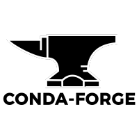
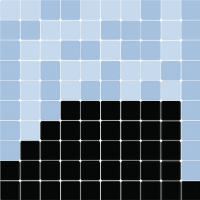
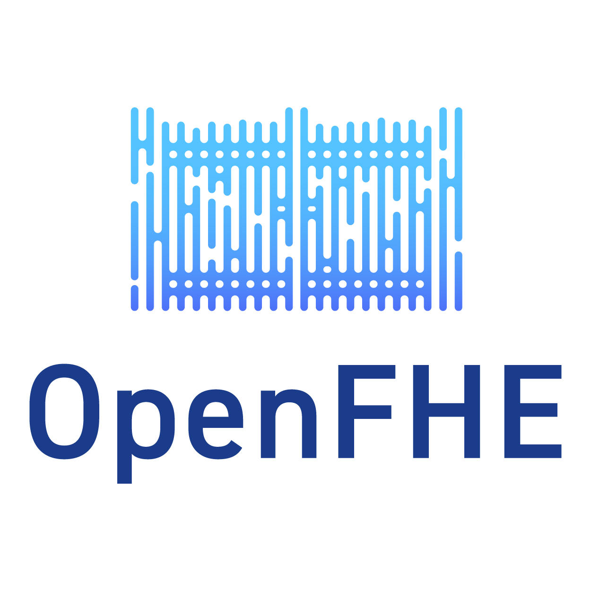

# Google Summer of Code

| [Sub organizations](#sub-organizations) | [IDEAS LIST][IL] | [Student guides][CONTRIBUTING]  |

[NumFOCUS][] will be applying again as an umbrella mentoring organization
for [Google Summer of Code 2025][GSoC]. [NumFOCUS][] supports and
promotes world-class, innovative, open source scientific software.

[NumFOCUS][]  is committed to promoting and sustaining a professional and ethical community. Our [Code of Conduct](https://numfocus.org/code-of-conduct) is our effort to uphold these values and it provides a guideline and some of the tools and resources necessary to achieve this.

[Google Summer of Code][GSoC] is an annual open source internship program
sponsored by Google. This repository contains information specific to NumFOCUS'
participation in GSoC. For general information about the competition, including
this year's application timeline and key phases involved, please see the [GSoC
website](https://summerofcode.withgoogle.com/how-it-works/)

<!--
This Git repository stores information about NumFOCUS' participation in
Google Summer of Code 2025 program and previous editions.
-->

This Git repository stores information about NumFOCUS'
application for Google Summer of Code in the current and previous years.

<!-- markdown-toc start - Don't edit this section. Run M-x markdown-toc-generate-toc again -->
**Table of Contents**

- [Google Summer of Code](#google-summer-of-code)
  - [Students](#students)
  - [Sub Organizations](#sub-organizations)
  - [Organizations Confirmed Under NumFOCUS Umbrella](#organizations-confirmed-under-numfocus-umbrella)

<!-- markdown-toc end -->

## Students

NumFOCUS is participating as a umbrella organization. This means that
you will need to identify a specific project to apply to under the
NumFOCUS umbrella. (Projects are listed below.)

Read [this document][CONTRIBUTING] to learn how to apply for the
GSoC program with NumFOCUS. Please also check out our [ideas list][IL].

For any questions, please open an issue in our [issue tracker][issues]
or send a email to gsoc@numfocus.org, our mailing list address.
Please also consider subscribing to the mailing list at
https://groups.google.com/a/numfocus.org/forum/#!forum/gsoc.

## Sub Organizations

If you want to participate as a sub organization of NumFOCUS please read
this [guide](CONTRIBUTING-mentors.md).

## Organizations Confirmed Under NumFOCUS Umbrella

<!--
The list should contain for each project.
 - A short description
 - link to their website
 - link to ideas page
 - link how to best contact them
 - link to beginners guide
-->

In alphabetic order.

<table>
  <tr>
     <td>
       
     </td>
     <td>
        <h1>aeon</h1>
        

          <a href="https://www.aeon-toolkit.org/">aeon</a> is an open-source scikit-learn compatible toolkit for time series tasks such as classification, regression, clustering, anomaly detection, segmentation and forecasting. It provides a broad library of time series algorithms, including efficient implementations of the latest advances in research.
        

        

          <a href="https://www.aeon-toolkit.org">Website</a> | <a href ="https://github.com/aeon-toolkit/aeon-admin/blob/main/gsoc/gsoc-2025-projects.md">Ideas Page</a> | <a href="https://join.slack.com/t/aeon-toolkit/shared_invite/zt-22vwvut29-HDpCu~7VBUozyfL_8j3dLA"> Slack</a> | <a href="https://github.com/aeon-toolkit/aeon">Source Code</a>
        

     </td>
   </tr>

  <tr>
    <td>
      
    </td>
    <td>
       <h1>AiiDA</h1>
       

          AiiDA is a python framework for managing computational science workflows, with roots in computational materials science. It helps researchers manage large numbers of simulations (10k, 100k, 1M, ...) and complex workflows involving multiple executables. At the same time, it records the provenance of the entire simulation pipeline with the aim to make it fully reproducible.
       

       

       <a href="https://www.aiida.net/">Website</a> | <a href="https://github.com/aiidateam/aiida-core/wiki/GSoC-2025-Projects">Ideas List</a> | <a href="https://aiida.discourse.group/">Discourse</a> | <a href="https://github.com/aiidateam/aiida-core">Source Code</a>
       

    </td>
  </tr>

  <tr>
    <td>
      
    </td>
    <td>
       <h1>ArviZ</h1>
       

        ArviZ is a project dedicated to promoting and building tools for exploratory analysis of Bayesian models. It currently has a Python and a Julia interface. ArviZ aims to integrate seamlessly with established probabilistic programming languages like PyStan, PyMC, Turing, Soss, emcee, or Pyro. Where the probabilistic programming languages aim to make it easy to build and solve Bayesian models, the ArviZ libraries aim to make it easy to process and analyze the results from those Bayesian models.
       

       

         <a href="https://python.arviz.org/">Website</a> | <a href="https://github.com/arviz-devs/arviz/wiki/GSoC-2025-projects">Ideas List</a> | <a href="https://gitter.im/arviz-devs/community"> Contact (Gitter) </a> | <a href="https://github.com/arviz-devs">Source Code</a>
       

    </td>
  </tr>

  <tr>
    <td>
      
    </td>
    <td>
       <h1>Bambi</h1>
       

      Bambi (BAyesian Model Building Interface) is an open source Python package designed to make it easier for practitioners to build statistical models from a wide range of families using a formula notation similar to those found in R. It is built on top of the PyMC probabilistic programming framework and the ArviZ package for exploratory analysis of Bayesian models.
       

       

         <a href="https://bambinos.github.io/bambi/">Website</a> | <a href="https://github.com/bambinos/bambi/wiki/GSoC-2024-projects">Ideas List</a> | <a href="https://github.com/bambinos/bambi/discussions"> Discussions </a> | <a href="https://github.com/bambinos">Source Code</a>
       

    </td>
  </tr>

  <tr>
    <td>
      
    </td>
    <td>
       <h1>biocommons</h1>
       

        The biocommons is a community that fosters collaboration on pre-competitive, interoperable, and high-quality bioinformatics open source software and data, primarily for biological sequence analysis and interpretation.  Our software is used by clinical genetics/diagnostics companies, computational biologists and scientists, and tool and database developers.
       

       

         <a href="https://biocommons.org/">Website</a> | <a href="https://github.com/orgs/biocommons/projects/8">Project Ideas</a> | <a href="https://biocommons.org/en/latest/community/getting-connected/">Getting Connected</a> | <a href="https://github.com/biocommons/">GitHub</a>
       

    </td>
  </tr>

  <tr>
    <td>
      
    </td>
    <td>
       <h1>CB-Geo MPM</h1>
       

          CB-Geo MPM is an HPC-enabled Material Point Method solver for large-deformation modeling. It supports isoparametric elements to model complex geometries and creates photo-realistic rendering.
       

       

       <a href="https://www.cb-geo.com/research/mpm/">Website</a> | <a href="https://github.com/cb-geo/mpm/discussions/744">Ideas List</a> | <a href="https://github.com/cb-geo/mpm/discussions">Discussions</a> | <a href="https://github.com/cb-geo/mpm">Source Code</a>
       

    </td>
  </tr>

  <tr>
    <td>
      
    </td>
    <td>
       <h1>Colour</h1>
       

          <a href="https://github.com/colour-science/colour">Colour</a> is an
          open-source <a href="https://www.python.org/">Python</a> package
          providing a comprehensive number of algorithms and datasets for
          colour science.
       

       

          It is freely available under the
          <a href="https://opensource.org/licenses/BSD-3-Clause">New BSD License</a>
          terms.
       

       

          <a href="https://www.colour-science.org/">Website</a> | <a href="https://github.com/colour-science/GSoC/blob/master/2023/GSoC-2023-Project-Ideas.md">Ideas List</a> | <a href="mailto:colour-developers@colour-science.org">Contact</a> | <a href="https://github.com/colour-science/colour">Source Code</a>
       

    </td>
  </tr>

  <tr>
    <td>
      
    </td>
    <td>
       <h1>CuPy</h1>
       

         CuPy is a NumPy/SciPy-compatible array library for GPU-accelerated computing with Python. CuPy acts as a drop-in replacement to run existing NumPy/SciPy code on NVIDIA CUDA or AMD ROCm platforms.
       

       

       <a href="https://cupy.dev">Website</a> | <a href="https://github.com/cupy/cupy/wiki/GSoC-2024-Project-Ideas">Ideas List</a> | <a href="https://gitter.im/cupy/community">Chat on Gitter</a> | <a href="https://groups.google.com/forum/#!forum/cupy">Contact</a> | <a href="https://github.com/cupy/cupy">Source Code</a>
       

    </td>
  </tr>

  <tr>
    <td>
      
    </td>
    <td>
       <h1>Conda Forge</h1>
       

        A community led collection of recipes, build infrastructure and distributions for the conda package manager.
       

       

         <a href="https://conda-forge.org">Website</a>  | <a href="https://hackmd.io/@conda-community/conda-gsoc-ideas-2024">Ideas List</a> | <a href="https://gitter.im/conda-forge/conda-forge.github.io"> Gitter </a> | <a href="https://github.com/conda-forge">Source Code</a>
       

    </td>
  </tr>

  <tr>
   <td>
     
   </td>
   <td>
      <h1>Data Retriever</h1>
      

        The Data Retriever ecosystem improves reproducible research through data product management. The platform takes advantage of freely available data sources in a variety of formats, standardizes them, and makes them available to scientists in a form that is ready to analyze. Data sources range from tabular data, spatial data packages and APIs. Several data packages use the ecosystems, and many projects support or rely on the ecosystem.
      

      

        <a href="http://www.data-retriever.org/">Website</a>  | <a href="https://github.com/weecology/retriever/wiki/GSoC-2025-Project-Ideas"> Ideas List</a> | <a href="https://gitter.im/weecology/retriever"> Contact (Gitter) </a> | <a href="https://github.com/weecology/retriever">Source Code</a>
      

   </td>
 </tr>

<tr>
   <td>
     
   </td>
   <td>
      <h1>FEniCS</h1>
      

       FEniCS is an automated finite element library used to solve equations used in modeling, featuring a domain-specific language and automated code generation. Users input a problem that looks very much like mathematical notation; FEniCS then translates that into computer code. It solves problems for which there is no analytical (exact) solution numerically.
      

      

        <a href="https://fenicsproject.org/">Website</a>  | <a href="https://github.com/FEniCS/gsoc/blob/gsoc-2024/2024/fenics-ideas-list.md"> Ideas List</a> | <a href="https://fenicsproject.org/community/"> Contact </a> | <a href="https://github.com/FEniCS">Source Code</a>
      

   </td>
 </tr>

  <tr>
    <td>
      
    </td>
    <td>
      <h1>FluxML</h1>
      

        FluxML is a 100%-pure Julia machine learning stack built on top of Julia's native automatic differentiation and GPU support. Our organization maintains packages for building and training neural networks, data pre-processing pipelines, standard deep learning models, automatic differentiation, and more. By writing our complete toolchain in Julia, we aim to make machine learning simple, extensible, and performant.
      

      

        <a href="https://fluxml.ai">Website</a> | <a href="https://fluxml.ai/gsoc">Ideas List</a> | <a href="https://julialang.org/community/#community_channels"> Contact (Slack or Zulip) </a> | <a href="https://github.com/FluxML">Source Code</a>
      

    </td>
  </tr>

  <tr>
   <td>
      
   </td>
   <td>
      <h1>Gridap</h1>
      

        Gridap is a new generation, open-source, finite element (FE) library implemented in the Julia programming language. Gridap aims at adopting a more modern programming style than existing FE applications written in C/C++ or Fortran.
      

      

        <a href="https://gridap.github.io/Tutorials/stable/">Website</a>  | <a href="https://github.com/gridap/GSoC/blob/main/2024/ideas-list.md"> Ideas List</a> | <a href="https://gitter.im/Gridap-jl/community"> Contact (Gitter) </a> | <a href="https://github.com/gridap/Gridap.jl">Source Code</a>
      

   </td>
 </tr>

  <tr>
    <td>
      
    </td>
    <td>
      <h1>JuMP</h1>
      

        JuMP is a modeling language and collection of supporting packages for mathematical optimization in Julia. JuMP makes it easy to formulate and solve a range of problem classes, including linear programs, integer programs, conic programs, semidefinite programs, and constrained nonlinear programs.
      

      

        <a href="https://jump.dev">Website</a> | <a href="https://github.com/jump-dev/GSOC2023">Ideas List</a> | <a href="https://app.gitter.im/#/room/#JuliaOpt_JuMP-dev:gitter.im"> Contact </a> | <a href="https://github.com/jump-dev">Source Code</a>
      

    </td>
  </tr>

  <tr>
    <td>
      
    </td>
    <td>
      <h1>JupyterLab</h1>
      

        JupyterLab is a web-based interactive development environment for notebooks, code, and data. Its flexible interface allows users to configure and arrange workflows in data science, scientific computing, computational journalism, and machine learning. A modular design invites extensions to expand and enrich functionality.
      

      

        JupyterLab is a project of the Jupyter organization: free software, open standards, and web services for interactive computing across all programming languages.
      

      

        <a href="https://jupyterlab.readthedocs.io/en/latest/">JupyterLab Website</a> | <a href="https://jupyter.org/">Jupyter Website</a> | <a href="https://github.com/orgs/jupyterlab/projects/8/views/1?pane=info">Ideas List</a> | <a href="https://app.gitter.im/#/room/#jupyterlab_jupyterlab:gitter.im">Contact</a> | <a href="https://github.com/jupyterlab/jupyterlab">Source Code</a>
      

    </td>
  </tr>

  <tr>
    <td>
      
    </td>
    <td>
       <h1>Matplotlib</h1>
       

         Matplotlib is a comprehensive library for creating static, animated, and interactive visualizations in Python. Matplotlib makes easy things easy and hard things possible.
       

       

       <a href="https://matplotlib.org">Website</a> | <a href="https://github.com/matplotlib/matplotlib/wiki/Matplotlib-GSoC-2024-Ideas">Ideas List</a> | <a href="https://gitter.im/matplotlib/matplotlib">Gitter</a> | <a href="https://github.com/matplotlib/matplotlib">Source Code</a>
       

    </td>
  </tr>

 <tr>
   <td>
     
   </td>
   <td>
      <h1>Mesa</h1>
      

        Mesa allows users to quickly create agent-based models using built-in core components (such as spatial grids and agent schedulers) or customized implementations; visualize them using a browser-based interface; and analyze their results using Python’s data analysis tools. Its goal is to be the Python 3-based counterpart to NetLogo, Repast, or MASON.
      

      

        <a href="https://mesa.readthedocs.io/en/main/">Website</a> | <a href ="https://github.com/projectmesa/mesa/wiki/Projects-for-Google-Summer-of-Code-2023">Ideas Page</a> | <a href="https://groups.google.com/g/projectmesa"> Contact (Mailing List) </a>| <a href="https://github.com/projectmesa/mesa">Source Code</a>
      

   </td>
 </tr>

 <tr>
   <td>
     
   </td>
   <td>
      <h1>NetworkX</h1>
      

        NetworkX is a Python package for the creation, manipulation, and study of the structure, dynamics, and functions of complex networks.
      

      

        <a href="https://networkx.org/">Website</a> | <a href ="http://networkx.org/documentation/latest/developer/projects.html#mentored-projects">Ideas Page</a> | <a href="https://github.com/networkx/networkx/discussions"> Contact (GitHub Discussions) </a>| <a href="https://github.com/networkx/networkx">Source Code</a>
      

   </td>
 </tr>

   <tr>
    <td>
     
   </td>
   <td>
      <h1>OpenFHE</h1>
      

        OpenFHE is an open-source Fully Homomorphic Encryption (FHE) library that includes efficient implementations of all common FHE schemes: BFV, BGV, CKKS, DM and CGGI.
      

      

        <a href="https://www.openfhe.org//">Website</a> | <a href ="https://github.com/openfheorg/openfhe-development/wiki/GSOC-2023">Ideas Page</a> | <a href="https://openfhe.discourse.group/"> Contact Us (Discourse)</a>| <a href="https://github.com/openfheorg/openfhe-development">Source Code</a>
      

   </td>
 </tr>

 <tr>
   <td>
     
   </td>
   <td>
      <h1>Open Science Labs</h1>
      

        Open Science Labs is a global community dedicated to creating an open space for teaching, learning, and sharing information about open science and computational tools. Our community develops tools that address real-world problems and collaborates with other projects and workgroups to improve technology and create international opportunities for our community. Although our focus may seem broad, we initially prioritize supporting Research Software Engineers (RSEs) who often face computational challenges in their work.
      

      

        <a href="https://opensciencelabs.org/">Website</a> | <a href ="https://github.com/OpenScienceLabs/gsoc/blob/main/project-ideas/gsoc2024.md">Ideas Page</a> | <a href="https://github.com/orgs/OpenScienceLabs/discussions"> Contact (GitHub Discussions) </a>| <a href="https://github.com/osl-incubator">Source Code</a>
     

   </td>
 </tr>

 <tr>
   <td>
    
   </td>
   <td>
      <h1>Optuna</h1>
      

        <a href="https://github.com/optuna/optuna">Optuna</a> is an open source hyperparameter optimization framework to automate hyperparameter search. Optuna features 1. define-by-run interface for defining search spaces, 2. state-of-the-art algorithms to efficiently search large spaces and prune unpromising trials for faster results, and 3. easy parallelization for hyperparameter searches over multiple threads or processes without modifying code.
      

      

        <a href="https://optuna.org/">Website</a> | <a href ="https://github.com/optuna/optuna/wiki/Optuna-GSoC-2024">Ideas Page</a> | <a href="mailto:optuna@preferred.jp">Contact</a> (optuna@preferred.jp)| <a href="https://github.com/optuna/optuna">Source Code</a>
     

   </td>
 </tr>

  <tr>
    <td>
      
    </td>
    <td>
       <h1>pvlib</h1>
       
pvlib python is a community developed toolbox that provides a set of functions and classes for simulating the performance of photovoltaic energy systems and accomplishing related tasks. The core mission of pvlib python is to provide open, reliable, interoperable, and benchmark implementations of PV system models.

       

         <a href="https://pvlib-python.readthedocs.io/en/stable/">Website</a> | <a href="https://groups.google.com/forum/#!forum/pvlib-python">Google Group Forum</a> | <a href="https://github.com/pvlib/pvlib-python/wiki/GSoC-2025-Projects">Ideas Page</a> | <a href="https://github.com/pvlib/pvlib-python"> Source Code</a>
       

    </td>
  </tr>

 <tr>
    <td>
      
    </td>
    <td>
       <h1>PyBaMM</h1>
       
PyBaMM (Python Battery Mathematical Modelling) solves physics-based electrochemical DAE models by using state-of-the-art automatic differentiation and numerical solvers.

       

         <a href="https://www.pybamm.org">Website</a> | <a href="https://pybamm.org/community/"> Contact </a> | <a href="https://pybamm.org/gsoc/2025/">Ideas Page</a> | <a href="https://github.com/pybamm-team/PyBaMM"> Source Code</a>
       

    </td>
  </tr>

<tr>
    <td>
      
    </td>
    <td>
       <h1>PyLops</h1>
       
 PyLops is an open-source Python library focused on providing a backend-agnostic, idiomatic, matrix-free library of linear operators and related computations. It is inspired by the iconic MATLAB Spot – A Linear-Operator Toolbox project.

       

         <a href="https://pylops.readthedocs.io/">Website</a> | <a href="https://pylops.slack.com/">Slack</a> | <a href="https://github.com/PyLops/pylops/wiki/GSoC-2023-Project-Ideas">Ideas Page</a> | <a href="https://github.com/PyLops/pylops"> Source Code</a>
       

    </td>
</tr>

<tr>
    <td>
      
    </td>
    <td>
       <h1>PyMC</h1>
       
PyMC is a python module for Bayesian statistical modeling and model fitting which focuses on advanced Markov chain Monte Carlo and variational fitting algorithms. Its flexibility and extensibility make it applicable to a large suite of problems.

       

         <a href="https://www.pymc.io/welcome.html">Website</a> | <a href="https://discourse.pymc.io/">discourse</a> | <a href="https://github.com/pymc-devs/pymc/wiki/GSoC-2025-projects">Ideas Page</a> | <a href="https://github.com/pymc-devs/pymc"> Source Code</a>
       

    </td>
</tr>

<tr>
    <td>
      
    </td>
    <td>
       <h1>PySAL</h1>
       
PySAL is a python library for geographical data science. It consists of 18 subpackages that cover a wide range of spatial analytical methods from exploratory spatial data analysis, spatial interaction modeling, spatial optimization, spatial econometrics, segregation, and spatial interpolation, among others.

       

       <a href="https://pysal.org">Website</a> | <a href="https://discord.gg/BxFTEPFFZn">Discord</a> | <a href="https://github.com/pysal/pysal/wiki/Google-Summer-of-Code-2025">Ideas Page</a> | <a href="https://github.com/pysal/pysal"> Source Code</a> 

    </td>
</tr>

  <tr>
    <td>
      
    </td>
    <td>
       <h1>PyTorch-Ignite</h1>
       
PyTorch-Ignite is a high-level library to help with training neural networks in PyTorch

       

         <a href="https://pytorch-ignite.ai/">Website</a> | <a href="https://pytorch-ignite.ai/chat/">Discord</a> | <a href="https://github.com/pytorch/ignite/discussions">GitHub Discussions</a> | <a href="https://github.com/pytorch/ignite/wiki/GSoC-2023-project-ideas">Ideas Page</a> | <a href="https://github.com/pytorch/ignite"> Source Code</a>
       

    </td>
  </tr>

  <tr>
    <td>
      
    </td>
    <td>
       <h1>QuTiP</h1>
       
 QuTiP is a software for simulating quantum systems. QuTiP aims to provide tools for user-friendly and efficient numerical simulations of open quantum systems. It can be used to simulate a wide range of physical phenomenon in areas such as quantum optics, trapped ions, superconducting circuits and quantum nanomechanical resonators. In addition, it contains a number of other modules to simplify the numerical simulation and study of many topics in quantum physics such as quantum optimal control, quantum information, and computing. 

       

         <a href="http://qutip.org">Website</a> | <a href="http://groups.google.com/group/qutip"> Contact </a> | <a href="https://github.com/qutip/qutip/wiki/Google-Summer-of-Code-2025">Ideas Page</a> | <a href="https://github.com/qutip/qutip"> Source Code</a>
       

    </td>
  </tr>

   <tr>
    <td>
      
    </td>
    <td>
       <h1>SciML</h1>
       
 SciML is an open source software organization created to unify the packages for scientific machine learning. This includes the development of modular scientific simulation support software, such as differential equation solvers, along with the methodologies for inverse problems and automated model discovery. By providing a diverse set of tools with a common interface, we provide a modular, easily-extendable, and highly performant ecosystem for handling a wide variety of scientific simulations. 

       

         <a href="http://sciml.ai">Website</a> | <a href=https://julialang.zulipchat.com/#narrow/stream/279055-sciml-bridged"> Contact </a> | <a href="https://sciml.ai/dev/#google_summer_of_code">Ideas Page</a> | <a href="https://github.com/SciML/"> Source Code</a>
       

    </td>
  </tr>

  <tr>
    <td>
      
    </td>
    <td>
       <h1>Stan</h1>
       
 Software for Bayesian Data Analysis.  Stan combines a probabilistic programming language,  written in OCaml, with a collection of inference algorithms, written in C++, and interfaces for Python, Julia, and R.   Stan's probabilistic programming language is suitable for a wide range of applications, from simple linear regression to multi-level models and time-series analysis.  The Stan ecosystem of tools for validation and visualization facilitates decision-making and communication.  

       

         <a href="https://mc-stan.org">Website</a> | <a href="https://discourse.mc-stan.org/t/google-summer-of-code-2025/38823">Contact</a> | <a href="https://github.com/stan-dev/stan/wiki/GSOC-2025-Proposed-Projects">Ideas Page</a> | <a href="https://github.com/stan-dev"> Source Code</a>
       

    </td>
  </tr>

  <tr>
    <td>
      
    </td>
    <td>
       <h1>Taskflow</h1>
       
 Parallel and heterogeneous programming with high performance and simultaneous high productivity 

       

         <a href="https://taskflow.github.io/">Website</a> | <a href="https://taskflow.github.io/#tag_contact">Contact</a> | <a href="https://github.com/taskflow/GSoC2024">Ideas Page</a> | <a href="https://github.com/taskflow/taskflow"> Source Code</a>
       

    </td>
  </tr>

  <tr>
    <td>
      
    </td>
    <td>
       <h1>TNL</h1>
       
 TNL is a collection of building blocks that facilitate the development of efficient numerical solvers and HPC algorithms. It is implemented in C++ using modern programming paradigms in order to provide a flexible and user-friendly interface such as the STL library, for example. TNL provides native support for modern hardware architectures such as multicore CPUs, GPUs, and distributed systems, which can be managed via a unified interface. 

       

         <a href="https://tnl-project.org">Website</a> | <a href="https://gitter.im/TNL-Project/community">Gitter</a> | <a href="https://gitlab.com/tnl-project/tnl/-/wikis/GSoC-2023">Ideas Page</a> | <a href="https://gitlab.com/tnl-project/tnl/-/tree/main"> Source Code</a>
       

    </td>
  </tr>

<tr>
    <td>
      
    </td>
    <td>
       <h1>Zarr</h1>
       
 Zarr is a file storage format for chunked, compressed, N-dimensional arrays based on an open-source specification. 

       

         <a href="https://zarr.dev/">Website</a> | <a href="https://ossci.zulipchat.com/">ZulipChat</a> | <a href="https://github.com/zarr-developers/gsoc/blob/main/2025/ideas-list.md">Ideas Page</a> | <a href="https://github.com/zarr-developers/zarr-python"> Source Code</a>
       

    </td>
  </tr>
<tr>
    <td>
      
    </td>
    <td>
       <h1>Conda</h1>
       
 Conda is a community governing the Conda package format and tools around it. 

       

         <a href="https://conda.org">Website</a> | <a href="https://conda.zulipchat.com/">ZulipChat</a> | <a href="https://github.com/conda/rattler/issues/1058">Ideas Page</a> | <a href="https://github.com/conda/rattler/"> Rattler (Conda in Rust) / Source Code</a>
       

    </td>
  </tr>

</table>

[ArviZ]: https://www.arviz.org
[AstroPy]: https://www.astropy.org/
[Blosc]: https://www.blosc.org/
[Bokeh]: https://docs.bokeh.org/en/latest/
[cantera]:  https://cantera.org/index.html
[Chainer]: https://chainer.org/
[Clawpack]: https://www.clawpack.org/
[CONTRIBUTING]: CONTRIBUTING-students.md
[Conda]: https://github.com/conda/conda
[conda-forge]: https://conda-forge.org
[Colour]: https://www.colour-science.org/
[CuPy]: https://cupy.dev/
[Cython]: https://cython.org/
[CF]: https://conda-forge.github.io/
[Dash]: https://plot.ly/dash/
[Dask]: https://dask.org/
[DR]: https://www.data-retriever.org/
[DyND]: http://libdynd.org/
[Econ-ARK]: https://econ-ark.github.io/HARK/
[equadratures]: https://equadratures.org/
[FEniCSproject]: https://fenicsproject.org/
[FluxML]: https://fluxml.ai
[Gensim]: https://radimrehurek.com/gensim/
[GSoC]: https://summerofcode.withgoogle.com/
[IL]: 2021/ideas-list.md
[IPython]: https://ipython.org/
[issues]: https://github.com/numfocus/gsoc/issues
[Julia]: https://julialang.org/
[JuMP]: https://jump.dev/
[Jupyter]: https://jupyter.org/
[JupyterLab]: https://jupyterlab.readthedocs.io/en/latest/
[Matplotlib]: https://matplotlib.org/
[MDAnalysis]: https://www.mdanalysis.org/
[NetworkX]: http://networkx.org/
[Numba]: http://numba.pydata.org/
[NumFOCUS-Projects]: https://numfocus.org/sponsored-projects
[NumFOCUS]: https://numfocus.org/
[NumPy]: https://numpy.org/
[nteract]: https://nteract.io/
[theoj]: http://www.theoj.org
[Optuna]: https://optuna.org
[Orange]: http://orange.biolab.si/
[pandas]: https://pandas.pydata.org/
[Pomegranate]: https://pomegranate.readthedocs.io/en/latest/
[pvlib]: https://pvlib-python.readthedocs.io/en/stable/
[PyMC]: https://www.pymc.io
[PySAL]: https://pysal.org/pysal
[PyTables]: http://pytables.github.com/
[PythonXY]: http://python-xy.github.io/
[PyTorch-Ignite]: https://pytorch-ignite.ai/
[QuTiP]: http://qutip.org/
[rOpenSci]: https://ropensci.org/
[quantecon]: https://quantecon.org/
[SCF]: https://carpentries.org/
[scikit-bio]: http://scikit-bio.org/
[scikit-image]: https://scikit-image.org/
[scikit-learn]: https://scikit-learn.org/stable/
[SciPy]: https://www.scipy.org/
[signac]: https://signac.io
[Spack]: https://spack.io
[Spyder]: https://www.spyder-ide.org/
[Statmodels]: http://www.statsmodels.org/stable/index.html
[Stan]: https://mc-stan.org/
[Shogun]: https://www.shogun-toolbox.org/
[SunPy]: https://sunpy.org/
[SymPy]: https://www.sympy.org/
[Theano]: http://deeplearning.net/software/theano/
[xarray]: http://xarray.pydata.org/
[Yellowbrick]: http://www.scikit-yb.org/en/latest/
[yt]: https://yt-project.org/
[Zarr]: https://zarr.dev/
