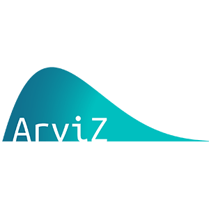
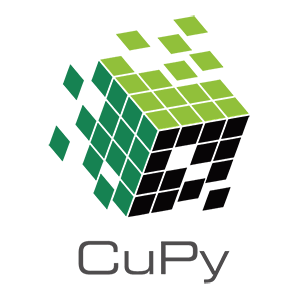
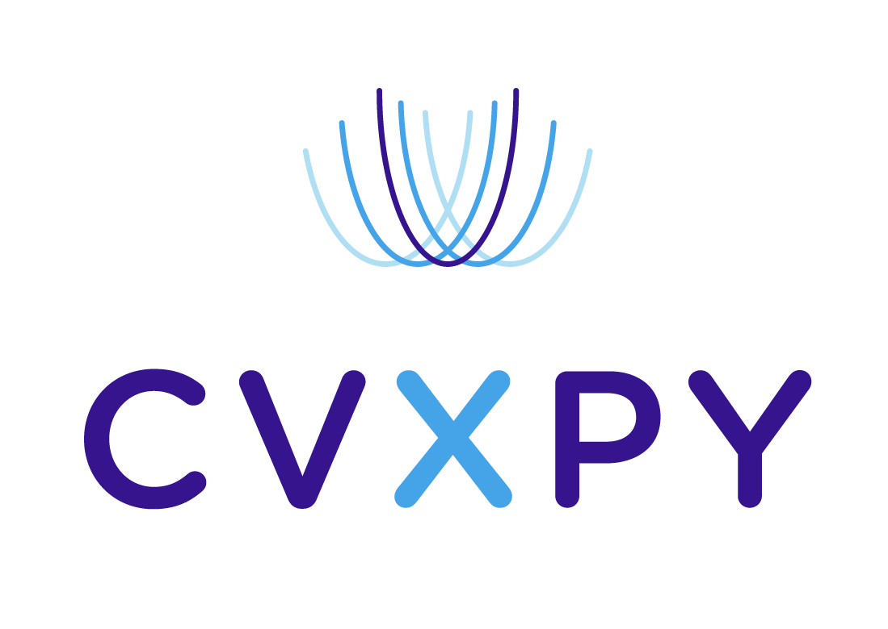
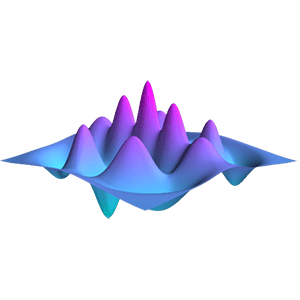
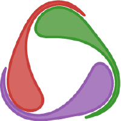

# Google Summer of Code

| [Sub organizations](#sub-organizations) | [IDEAS LIST][IL] | [Student guides][CONTRIBUTING]  |

[NumFOCUS][] will be applying again as an umbrella mentoring organization
for [Google Summer of Code 2022][GSoC]. [NumFOCUS][] supports and
promotes world-class, innovative, open source scientific software.

[NumFOCUS][]  is committed to promoting and sustaining a professional and ethical community. Our [Code of Conduct](https://numfocus.org/code-of-conduct) is our effort to uphold these values and it provides a guideline and some of the tools and resources necessary to achieve this.

[Google Summer of Code][GSoC] is an annual open source internship program
sponsored by Google. This repository contains information specific to NumFOCUS'
participation in GSoC. For general information about the competition, including
this year's application timeline and key phases involved, please see the [GSoC
website](https://summerofcode.withgoogle.com/how-it-works/)

<!--
This Git repository stores information about NumFOCUS' participation in
Google Summer of Code 2022 program and previous editions.
-->

This Git repository stores information about NumFOCUS'
application for Google Summer of Code in the current and previous years.

<!-- markdown-toc start - Don't edit this section. Run M-x markdown-toc-generate-toc again -->
**Table of Contents**

- [Students](#students)
- [Sub Organizations](#sub-organizations)
- [Organizations Confirmed Under NumFOCUS Umbrella](#organizations-confirmed-under-numfocus-umbrella)
- [NumFOCUS Projects](#numfocus-projects)
    - [Fiscally Sponsored Projects GSoC Status](#fiscally-sponsored-projects-gsoc-status)
    - [Affiliated Projects GSoC Status](#affiliated-projects-gsoc-status)
    - [Other Projects GSoC Status](#other-projects-gsoc-status)
- [About GSoC](#about-gsoc)

<!-- markdown-toc end -->

## Students

NumFOCUS is participating as a umbrella organization. This means that
you will need to identify a specific project to apply to under the
NumFOCUS umbrella. (Projects are listed below.)

Read [this document][CONTRIBUTING] to learn how to apply for the
GSoC program with NumFOCUS. Please also check out our [ideas list][IL].

For any questions, please open an issue in our [issue tracker][issues]
or send a email to gsoc@numfocus.org, our mailing list address.
Please also consider subscribing to the mailing list at
https://groups.google.com/a/numfocus.org/forum/#!forum/gsoc.

## Sub Organizations

If you want to participate as a sub organization of NumFOCUS please read
this [guide](CONTRIBUTING-mentors.md).

## Organizations Confirmed Under NumFOCUS Umbrella

<!--
The list should contain for each project.
 - A short description
 - link to their website
 - link to ideas page
 - link how to best contact them
 - link to beginners guide
-->

In alphabetic order.

<table>
  <tr>
    <td>
      
    </td>
    <td>
       <h1>ArviZ</h1>
       

        ArviZ, is a project dedicated to promote and build tools for exploratory analysis of Bayesian models. It currently has a Python and a Julia interface. ArviZ aims to integrate seamlessly with established probabilistic programming languages like PyStan, PyMC (3 and 4), Turing, Soss, emcee or Pyro. Where the aim of the probabilistic programming languages is to make it easy to build and solve Bayesian models, the aim of the ArviZ libraries is to make it easy to process and analyze the results from those Bayesian models.
       

       

         <a href="https://arviz-devs.github.io/">Website</a> | <a href="https://github.com/arviz-devs/arviz/wiki/GSoC-2022-projects">Ideas List</a> | <a href="https://gitter.im/arviz-devs/community"> Contact (Gitter) </a> | <a href="https://github.com/arviz-devs">Source Code</a>
       

    </td>
  </tr>

  <tr>
    <td>
      
    </td>
    <td>
       <h1>CB-Geo MPM</h1>
       

          CB-Geo MPM is an HPC-enabled Material Point Method solver for large-deformation modeling. It supports isoparametric elements to model complex geometries and creates photo-realistic rendering.
       

       

       <a href="https://www.cb-geo.com/research/mpm/">Website</a> | <a href="https://github.com/cb-geo/mpm/issues/704#issue-796189505">Ideas List</a> | <a href="https://cb-geo.discourse.group">Discourse</a> | <a href="https://github.com/cb-geo/mpm">Source Code</a>
       

    </td>
  </tr>

  <tr>
    <td>
      
    </td>
    <td>
       <h1>CuPy</h1>
       

         CuPy is a NumPy/SciPy-compatible array library for GPU-accelerated computing with Python. CuPy acts as a drop-in replacement to run existing NumPy/SciPy code on NVIDIA CUDA or AMD ROCm platforms.
       

       

       <a href="https://cupy.dev">Website</a> | <a href="https://github.com/cupy/cupy/wiki/GSoC-2022-Project-Ideas">Ideas List</a> | <a href="https://gitter.im/cupy/community">Chat on Gitter</a> | <a href="https://groups.google.com/forum/#!forum/cupy">Contact</a> | <a href="https://github.com/cupy/cupy">Source Code</a>
       

    </td>
</tr>

<tr>
    <td>
      
    </td>
    <td>
       <h1>CVXPY</h1>
       

         CVXPY is an open source Python-embedded modeling language for convex optimization problems. It lets you express your problem in a natural way that follows the math, rather than in the restrictive standard form required by solvers.
       

       

       <a href="https://www.cvxpy.org/">Website</a> | <a href="https://github.com/cvxpy/GSOC2022">Ideas List</a> | <a href="https://discord.com/invite/4urRQeGBCr">Contact (Discord)</a> | <a href="https://github.com/cvxpy/cvxpy">Source Code</a>
       

    </td>
  </tr>

  <tr>
   <td>
     
   </td>
   <td>
      <h1>Data Retriever</h1>
      

        The Data Retriever ecosystem improves reproducible research through data product management. The platform takes advantage of freely available data sources in a variety of formats, standardizes them, and makes them available to scientists in a form that is ready to analyze. Data sources range from tabular data, spatial data packages and APIs. Several data packages use the ecosystems, and many projects support or rely on the ecosystem.     
      

      

        <a href="http://www.data-retriever.org/">Website</a>  | <a href="https://github.com/weecology/retriever/wiki/GSoC-2022-Project-Ideas"> Ideas List</a> | <a href="https://gitter.im/weecology/retriever"> Contact (Gitter) | <a href="https://github.com/weecology/retriever">Source Code</a> 
      

   </td>
 </tr>

<tr>
   <td>
     
   </td>
   <td>
      <h1>FEniCS</h1>
      

       FEniCS is an automated finite element library used to solve equations used in modeling, featuring a domain-specific language and automated code generation. Users input a problem that looks very much like mathematical notation; FEniCS then translates that into computer code. It solves problems for which there is no analytical (exact) solution numerically.
      

      

        <a href="https://fenicsproject.org/">Website</a>  | <a href="https://github.com/FEniCS/gsoc/blob/fenics/ideas-2022/2022/ideas-list-fenics.md"> Ideas List</a> | <a href="https://fenicsproject.org/community/"> Contact | <a href="https://github.com/FEniCS">Source Code</a>
      

   </td>
 </tr>

  <tr>
    <td>
      
    </td>
    <td>
      <h1>FluxML</h1>
      

        FluxML is a 100%-pure Julia machine learning stack built on top of Julia's native automatic differentiation and GPU support. Our organization maintains packages for building and training neural networks, data pre-processing pipelines, standard deep learning models, automatic differentiation, and more. By writing our complete toolchain in Julia, we aim to make machine learning simple, extensible, and performant.
      

      

        <a href="https://fluxml.ai">Website</a> | <a href="https://julialang.org/jsoc/gsoc/flux/">Ideas List</a> | <a href="https://julialang.org/community/#community_channels"> Contact (Slack or Zulip) | <a href="https://github.com/FluxML">Source Code</a>
      

    </td>
  </tr>

  <tr>
   <td>
     
   </td>
   <td>
      <h1>GeoPandas</h1>
      

         GeoPandas is an open-source project that makes it easier to work with geospatial data in Python. GeoPandas combines the capabilities of pandas and shapely (python interface to the GEOS library), providing geospatial operations in pandas and a high-level and performant interface to multiple geometries to shapely. GeoPandas enables you to easily do operations in Python that would otherwise require desktop applications like ArcGIS or QGIS or a spatial database such as PostGIS.
       

       

         <a href="https://geopandas.org">Website</a>  | <a href="https://github.com/geopandas/geopandas/wiki/Google-Summer-of-Code-2022"> Ideas List</a> | <a href="https://gitter.im/geopandas/geopandas"> Contact | <a href="https://github.com/geopandas">Source Code</a>
    </td>
  </tr>

  <tr>
   <td>
      
   </td>
   <td>
      <h1>Gridap</h1>
      

        Gridap is a new generation, open-source, finite element (FE) library implemented in the Julia programming language. Gridap aims at adopting a more modern programming style than existing FE applications written in C/C++ or Fortran.
      

      

        <a href="https://gridap.github.io/Tutorials/stable/">Website</a>  | <a href="https://github.com/gridap/GSoC/blob/main/2022/ideas-list.md"> Ideas List</a> | <a href="https://gitter.im/Gridap-jl/community"> Contact (Gitter) | <a href="https://github.com/gridap/Gridap.jl">Source Code</a>
      

   </td>
 </tr>

    
 <tr>
   <td>
     
   </td>
   <td>
      <h1>LFortran</h1>
      

        LFortran is a modern open-source (BSD licensed) interactive Fortran compiler built on top of LLVM. It can execute user’s code interactively to allow exploratory work (much like Python, MATLAB or Julia) as well as compile to binaries with the goal to run user’s code on modern architectures such as multi-core CPUs and GPUs.
      

      

        <a href="https://lfortran.org/">Website</a> | <a href="https://lfortran.zulipchat.com/">Developers chat on Zulip</a> | <a href ="https://gitlab.com/lfortran/lfortran/-/wikis/GSoC-2022-Ideas">Ideas Page</a> | <a href="https://gitlab.com/lfortran/lfortran">Source Code</a>
      

   </td>
 </tr>

 <tr>
   <td>
     
   </td>
   <td>
      <h1>NetworkX</h1>
      

        NetworkX is a Python package for the creation, manipulation, and study of the structure, dynamics, and functions of complex networks.
      

      

        <a href="https://networkx.org/">Website</a> | <a href ="http://networkx.org/documentation/latest/developer/projects.html#mentored-projects">Ideas Page</a> | <a href="https://github.com/networkx/networkx/discussions"> Contact (GitHub Discussions) </a>| <a href="https://github.com/networkx/networkx">Source Code</a>
      

   </td>
 </tr>

<tr>
   <td>
     
   </td>
   <td>
      <h1>Optuna</h1>
      

        Optuna is an open source hyperparameter optimization framework to automate hyperparameter search. Optuna provides eager search spaces for automated search for optimal hyperparameters using Python conditionals, loops, and syntax, state-of-the-art algorithms to efficiently search large spaces and prune unpromising trials for faster results, and easy parallelization for hyperparameter searches over multiple threads or processes without modifying code.
      

      

        <a href="https://optuna.org">Website</a> | <a href="https://gitter.im/optuna/optuna">Developers chat on Gitter</a> | <a href ="https://github.com/optuna/optuna/wiki/Optuna-GSoC-2022">Ideas Page</a> | <a href="https://github.com/optuna/optuna">Source Code</a>
      

   </td>
 </tr>

  <tr>
    <td>
      
    </td>
    <td>
       <h1>pvlib</h1>
       
 pvlib python provides a set of functions and classes for simulating the performance of photovoltaic energy systems. 

       

       <a href="https://pvlib-python.readthedocs.io/en/stable/">Website</a> | <a href="https://groups.google.com/forum/#!forum/pvlib-python">Google Group Forum</a> | <a href="https://github.com/pvlib/pvlib-python/wiki/GSoC-2022-Projects">Ideas Page</a> | <a href="https://github.com/pvlib/pvlib-python"> Source Code</a>
       

    </td>
  </tr>

 <tr>
    <td>
      
    </td>
    <td>
       <h1>PyBaMM</h1>
       
PyBaMM (Python Battery Mathematical Modelling) solves physics-based electrochemical DAE models by using state-of-the-art automatic differentiation and numerical solvers.

       

         <a href="https://www.pybamm.org">Website</a> | <a href="https://www.pybamm.org/contact"> Contact </a> | <a href="https://github.com/pybamm-team/PyBaMM/wiki/GSoC-2022-Projects">Ideas Page</a> | <a href="https://github.com/pybamm-team/PyBaMM"> Source Code</a>
       

    </td>
  </tr>

<tr>
    <td>
      
    </td>
    <td>
       <h1>PyMC</h1>
       
PyMC is a python module for Bayesian statistical modeling and model fitting which focuses on advanced Markov chain Monte Carlo and variational fitting algorithms. Its flexibility and extensibility make it applicable to a large suite of problems.

       

         <a href="https://docs.pymc.io/en/v3/">Website</a> | <a href="https://discourse.pymc.io/">discourse</a> | <a href="https://github.com/pymc-devs/pymc/wiki/GSoC-2022-projects">Ideas Page</a> | <a href="https://github.com/pymc-devs/pymc3"> Source Code</a>
       

    </td>
</tr>

<tr>
    <td>
      
    </td>
    <td>
       <h1>PySAL</h1>
       
PySAL is an open source cross-platform library for geospatial data science. It supports many different areas of statistics and geographical analyses, such as the detection of spatial clusters, hotspots, and outliers; the construction of graphs from geographic data; Bayesian and Maximum Likelihood spatial regression and statistical modelling for geographical networks; spatial econometrics; space-time Markov modelling; and distribution dynamics for segregation and inequality. 

       

         <a href="https://pysal.org/pysal/">Website</a> | <a href="https://gitter.im/pysal/pysal">Contact (Gitter chat room)</a> | <a href="https://github.com/pysal/pysal/wiki/Google-Summer-of-Code-2022">Ideas Page</a> | <a href="https://github.com/pysal/pysal"> Source Code</a>
       

    </td>
</tr>

  <tr>
    <td>
      
    </td>
    <td>
       <h1>PyTorch-Ignite</h1>
       
PyTorch-Ignite is a high-level library to help with training neural networks in PyTorch

       

         <a href="https://pytorch-ignite.ai/">Website</a> | <a href="https://pytorch-ignite.ai/chat/">Discord</a> | <a href="https://github.com/pytorch/ignite/discussions">GitHub Discussions</a> | <a href="https://github.com/pytorch/ignite/wiki/GSoC-2022-project">Ideas Page</a> | <a href="https://github.com/pytorch/ignite"> Source Code</a>
       

    </td>
  </tr>

  <tr>
    <td>
      
    </td>
    <td>
       <h1>QuTiP</h1>
       
 QuTiP is a software for simulating quantum systems. QuTiP aims to provide tools for user-friendly and efficient numerical simulations of open quantum systems. It can be used to simulate a wide range of physical phenomenon in areas such as quantum optics, trapped ions, superconducting circuits and quantum nanomechanical resonators. In addition, it contains a number of other modules to simplify the numerical simulation and study of many topics in quantum physics such as quantum optimal control, quantum information, and computing. 

       

         <a href="http://qutip.org">Website</a> | <a href="http://groups.google.com/group/qutip"> Contact </a> | <a href="https://github.com/qutip/qutip/wiki/Google-Summer-of-Code-2022">Ideas Page</a> | <a href="https://github.com/qutip/qutip"> Source Code</a>
       

    </td>
  </tr>

  <tr>
    <td>
      
    </td>
    <td>
       <h1>SciML</h1>
       
 SciML is an open source software organization created to unify the packages for scientific machine learning. This includes the development of modular scientific simulation support software, such as differential equation solvers, along with the methodologies for inverse problems and automated model discovery. By providing a diverse set of tools with a common interface, we provide a modular, easily-extendable, and highly performant ecosystem for handling a wide variety of scientific simulations. 

       

         <a href="https://sciml.ai">Website</a> | <a href="https://sciml.ai/community/#discourse">Discourse</a> | <a href="https://sciml.ai/dev/#google_summer_of_code">Ideas Page</a> | <a href="https://github.com/SciML"> Source Code</a>
       

    </td>
  </tr>

  <tr>
    <td>
      
    </td>
    <td>
       <h1>signac</h1>
       
 The signac framework is a complete solution for managing workflows operating on file-based data designed to scale to HPC systems. 

       

         <a href="https://signac.io">Website</a> | <a href="https://github.com/glotzerlab/signac/wiki/GSoC-2022-Projects">Ideas Page</a> | <a href="https://github.com/glotzerlab/signac"> Source Code</a>
       

    </td>
  </tr>

  <tr>
    <td>
      
    </td>
    <td>
       <h1>Taskflow</h1>
       
 Parallel and heterogeneous programming with high performance and simultaneous high productivity 

       

         <a href="https://taskflow.github.io/">Website</a> | <a href="https://taskflow.github.io/#tag_contact">Contact</a> | <a href="https://github.com/taskflow/GSoC2022">Ideas Page</a> | <a href="https://github.com/taskflow/taskflow"> Source Code</a>
       

    </td>
  </tr>

  <tr>
    <td>
      
    </td>
    <td>
       <h1>Zarr</h1>
       
 Zarr is a format for the storage of chunked, compressed, N-dimensional arrays. These documents describe the Zarr format and its Python implementation. 

       

         <a href="https://zarr.dev/">Website</a> | <a href="https://gitter.im/zarr-developers/community">Gitter</a> | <a href="https://github.com/zarr-developers/gsoc/blob/main/2022/ideas-list.md">Ideas Page</a> | <a href="https://github.com/zarr-developers/zarr-python"> Source Code</a>
       

    </td>
  </tr>
 
</table>

[ArviZ]: https://arviz-devs.github.io/arviz/
[AstroPy]: https://www.astropy.org/
[Blosc]: https://www.blosc.org/
[Bokeh]: https://docs.bokeh.org/en/latest/
[cantera]:  https://cantera.org/index.html
[Chainer]: https://chainer.org/
[Clawpack]: https://www.clawpack.org/
[CONTRIBUTING]: CONTRIBUTING-students.md
[Conda]: https://github.com/conda/conda
[conda-forge]: https://conda-forge.org
[Colour]: https://www.colour-science.org/
[CuPy]: https://cupy.dev/
[Cython]: https://cython.org/
[CF]: https://conda-forge.github.io/
[Dash]: https://plot.ly/dash/
[Dask]: https://dask.org/
[DR]: https://www.data-retriever.org/
[DyND]: http://libdynd.org/
[Econ-ARK]: https://econ-ark.github.io/HARK/
[equadratures]: https://equadratures.org/
[FEniCSproject]: https://fenicsproject.org/
[FluxML]: https://fluxml.ai
[Gensim]: https://radimrehurek.com/gensim/
[GSoC]: https://summerofcode.withgoogle.com/
[IL]: 2021/ideas-list.md
[IPython]: https://ipython.org/
[issues]: https://github.com/numfocus/gsoc/issues
[Julia]: https://julialang.org/
[JuMP]: https://jump.dev/
[Jupyter]: https://jupyter.org/
[Matplotlib]: https://matplotlib.org/
[MDAnalysis]: https://www.mdanalysis.org/
[NetworkX]: http://networkx.org/
[Numba]: http://numba.pydata.org/
[NumFOCUS-Projects]: https://numfocus.org/sponsored-projects
[NumFOCUS]: https://numfocus.org/
[NumPy]: https://numpy.org/
[nteract]: https://nteract.io/
[theoj]: http://www.theoj.org
[Optuna]: https://optuna.org
[Orange]: http://orange.biolab.si/
[pandas]: https://pandas.pydata.org/
[Pomegranate]: https://pomegranate.readthedocs.io/en/latest/
[pvlib]: https://pvlib-python.readthedocs.io/en/stable/
[PySAL]: https://pysal.org/pysal
[PyTables]: http://pytables.github.com/
[PythonXY]: http://python-xy.github.io/
[PyTorch-Ignite]: https://pytorch-ignite.ai/
[QuTiP]: http://qutip.org/
[rOpenSci]: https://ropensci.org/
[quantecon]: https://quantecon.org/
[SCF]: https://carpentries.org/
[scikit-bio]: http://scikit-bio.org/
[scikit-image]: https://scikit-image.org/
[scikit-learn]: https://scikit-learn.org/stable/
[SciPy]: https://www.scipy.org/
[signac]: https://signac.io
[Spack]: https://spack.io
[Spyder]: https://www.spyder-ide.org/
[Statmodels]: http://www.statsmodels.org/stable/index.html
[Stan]: https://mc-stan.org/
[Shogun]: https://www.shogun-toolbox.org/
[SunPy]: https://sunpy.org/
[SymPy]: https://www.sympy.org/
[Theano]: http://deeplearning.net/software/theano/
[xarray]: http://xarray.pydata.org/
[Yellowbrick]: http://www.scikit-yb.org/en/latest/
[yt]: https://yt-project.org/
[Zarr]: https://zarr.dev/
