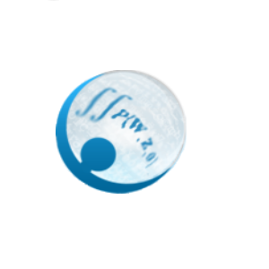

# Google Summer of Code

| [Sub organizations](https://github.com/numfocus/gsoc/tree/update-docs#sub-organizations) | [IDEAS LIST][IL] | [Student guides][CONTRIBUTING]  |

[NumFOCUS][] will be an umbrella mentoring organization
for [Google Summer of Code 2018][GSoC]. [NumFOCUS][] supports and 
promotes world-class, innovative, open source scientific software.

<!--
This Git repository stores information about NumFOCUS' participation in
Google Summer of Code 2018 program and previous editions.
-->

This Git repository stores information about NumFOCUS'
application for Google Summer of Code in the current and previous years.

<!-- markdown-toc start - Don't edit this section. Run M-x markdown-toc-generate-toc again -->
**Table of Contents**

- [Google Summer of Code](#google-summer-of-code)

    - [Students](#students)
    - [Sub Organizations](#sub-organizations)
    - [Organizations Confirmed Under NumFOCUS Umbrella](#organizations-confirmed-under-numfocus-umbrella)
    - [NumFOCUS Projects](#numfocus-projects)
        - [Fiscally Sponsored Projects GSoC Status](#fiscally-sponsored-projects-gsoc-status)
        - [Affiliated Projects GSoC Status](#affiliated-projects-gsoc-status)
        - [Other Projects GSoC Status](#other-projects-gsoc-status)

<!-- markdown-toc end -->

## Students 

NumFOCUS is participating as a umbrella organization. This means that
you will need to identify a specific project to apply to under the
NumFOCUS umbrella. (Projects are listed below.)

Read [this document][CONTRIBUTING] to learn how to apply for the
GSoC program with NumFOCUS. Please also check out our [ideas list][IL].

For any questions, please open an issue in our [issue tracker][issues]
or send a email to gsoc@numfocus.org, our mailing list address.
Please also consider subscribing to the mailing list at
https://groups.google.com/a/numfocus.org/forum/#!forum/gsoc.

## Sub Organizations

If you want to participate as a sub organization of NumFOCUS please read
this [guide](CONTRIBUTING-mentors.md).

## Organizations Confirmed Under NumFOCUS Umbrella

<!-- 
The list should contain for each project.
 - A short description 
 - link to their website
 - link to ideas page
 - link how to best contact them
 - link to beginners guide
-->

In alphabetic order.

<table>

  <tr>
    <td>
      
    </td>
    <td>
       <h1>Conda Forge</h1>
       

        A community led collection of recipes, build infrastructure and distributions for the conda package manager.
       

       

         <a href="https://conda-forge.github.io/">Website</a>  | <a href="https://gitter.im/conda-forge/conda-forge.github.io">Gitter</a>
       

    </td>
  </tr>
  
  <tr>
   <td>
     
   </td>
   <td>
      <h1>Data Retriever</h1>
      

        The Data Retriever is a package manager for data. It downloads, cleans,
        and stores publicly available data, so that analysts spend less time
        cleaning and managing data, and more time analyzing it.
      

      

        <a href="http://www.data-retriever.org/">Website</a>  | <a href="https://github.com/weecology/retriever/issues">Issues</a>
      

   </td>
 </tr>

  <tr>
   <td>
     
   </td>
   <td>
      <h1>FEniCS</h1>
      

        FEniCS is an automated finite element library used to solve equations used in
        modeling, featuring a domain-specific language and automated code generation.
        Users input a problem that looks very much like mathematical notation; FEniCS
        then translates that into computer code. It solves problems for which there is
        no analytical (exact) solution numerically.
      

      

        <a href="https://fenicsproject.org/">Website</a> | <a href="https://fenicsproject.org/community/">Community Page With Access to Slack</a>
      

   </td>
 </tr>
  
 <tr>
   <td>
     
   </td>
   <td>
      <h1>Gensim</h1>
      
"Topic Modelling for Humans." Gensim is an open-source Python library for topic modelling, document indexing and similarity retrieval with large corpora. Target audience is the natural language processing (NLP) and information retrieval (IR) community. Memory-independent and distributed algorithms.

      

        <a href="https://github.com/RaRe-Technologies/gensim">Website</a>  | <a href="https://github.com/RaRe-Technologies/gensim/wiki/GSOC-2018-project-ideas">Ideas Page</a> | <a href="mailto:student-projects@rare-technologies.com">Mailing List</a>
      

   </td>
 </tr>
 
  <tr>
   <td>
     
   </td>
   <td>
      <h1>Julia</h1>
      
Julia is a high-level, high-performance dynamic programming language for numerical computing. It provides a sophisticated compiler, distributed parallel execution, numerical accuracy, and an extensive mathematical function library. Julia’s Base library, largely written in Julia itself, also integrates mature, best-of-breed open source C and Fortran libraries for linear algebra, random number generation, signal processing, and string processing. 

      

        <a href="https://julialang.org/">Website</a>  | <a href="https://julialang.org/soc/ideas-page.html">Ideas Page</a> | <a href="https://discourse.julialang.org/">discourse</a>
      

   </td>
 </tr>

  <tr>
    <td>
      
    </td>
    <td>
       <h1>MDAnalysis</h1>
       
MDAnalysis is a Python library to analyze trajectories from molecular dynamics (MD) simulations.

       

         <a href="https://www.mdanalysis.org/">Website</a> | <a href="https://groups.google.com/forum/#!forum/mdnalysis-devel">Mailing list</a>
       

    </td>
  </tr>

  <tr>
    <td>
      
    </td>
    <td>
       <h1>PyMC3</h1>
       
PyMC3 is a python module for Bayesian statistical modeling and model fitting which focuses on advanced Markov chain Monte Carlo and variational fitting algorithms. Its flexibility and extensibility make it applicable to a large suite of problems.

       

         <a href="https://pymc-devs.github.io/pymc3/">Website</a> | <a href="https://discourse.pymc.io/">discourse</a> 
       

    </td>
  </tr>
  
  <tr>
    <td>
      
    </td>
    <td>
       <h1>Stan</h1>
       
Stan is a probabilistic programming language for data analysis, enabling automatic inference for a large class of statistical models. It features full Bayesian inference with Markov chain Monte Carlo sampling, approximate Bayesian inference with variational inference and the Laplace approximation, and penalized maximum likelihood estimation with optimization. The language integrates a Math Library written in C++, which can act as a stand-alone, and features derivatives for arithmetic, special functions, probability functions, and linear algebra.

       

         <a href="http://mc-stan.org/">Website</a> | <a href="http://discourse.mc-stan.org">Mailing List</a> | <a href="https://github.com/numfocus/gsoc/blob/master/2018/ideas-list-stan.md">Ideas Page</a>
       

    </td>
  </tr>

<tr>
   <td>
     
   </td>
   <td>
      <h1>Shogun</h1>
      
Shogun is and open-source machine learning library that offers a wide range of efficient and unified machine learning methods.

      

        <a href="http://shogun.ml/">Website</a> | <a href="https://github.com/shogun-toolbox/shogun/wiki/Google-Summer-of-Code-2018-Projects">Ideas Page</a> | <a href="https://gitter.im/shogun-toolbox/shogun">Gitter</a>
      

   </td>
 </tr>

 <tr>
   <td>
     
   </td>
   <td>
      <h1>yt</h1>
      
yt is a community-developed analysis and visualization toolkit for examining datasets in a variety of scientific disciplines. yt aims to provide a simple uniform way of handling volumetric data, regardless of where it is generated. yt is developed in Python under the open-source model.

      

        <a href="http://yt-project.org/">Website</a> | <a href="http://yt-project.org/community.html">community-page</a> | <a href="https://mail.python.org/mm3/mailman3/lists/yt-dev.python.org/">mailing-list </a>
      

   </td>
 </tr>
 
</table>

## NumFOCUS Organizations

Not all NumFOCUS organizations participate under our umbrella. These lists show
which organizations are participating with GSoC and where you can find
information how to work with them.

### Fiscally Sponsored Organizations GSoC Status

| Project                         | Status                           | Ideas Pages                                         |
| -------                         | ------                           | -----------                                         |
| [AstroPy]                       | Applying with Open Astronomy     | http://openastronomy.org/gsoc/gsoc2018/#/projects   |
| [Econ-ARK][Econ-ARK]            | Not Participating                |                                                     |
| [FEniCS Project][FEniCSproject] | Applying under NumFOCUS umbrella |                                                     |
| [IPython]                       | Unknown                          |                                                     |
| [Julia]                         | Applying under NumFOCUS umbrella |                                                     |
| [Matplotlib]                    | Unknown                          |                                                     |
| [nteract]                       | Unknown                          |                                                     |
| [NumPy]                         | Not Participating                |                                                     |
| [Open Journals][theoj]          | Unknown                          |                                                     |
| [Project Jupyter][Jupyter]      | Unknown                          |                                                     |
| [pandas]                        | Unknown                          |                                                     |
| [PyMC3](pymc3)                  | Applying under NumFOCUS umbrella |                                                     |
| [PyTables]                      | Unknown                          |                                                     |
| [QuantEcon]                     | Unknown                          |                                                     |
| [rOpenSci]                      | Not Participating                |                                                     |
| [Shogun]                        | Applying under NumFOCUS umbrella |                                                     |
| [SunPy]                         | Applying with Open Astronomy     | http://openastronomy.org/gsoc/gsoc2018/#/projects   |
| [SymPy]                         | Applying as SymPy                | https://github.com/sympy/sympy/wiki/GSoC-2018-Ideas |
| [Stan]                          | Applying under NumFOCUS umbrella |                                                     |
| [yt]                            | Applying under NumFOCUS umbrella |                                                     |
| [cantera]                       | Unkown                           |                                                     |

### Affiliated Organizations GSoC Status

| Project              | Status                           | Ideas Pages |
| -------              | ------                           | ----------- |
| [Bokeh]              | Unknown                          |             |
| [Conda]              | Unknown                          |             |
| [conda-forge]        | Applying under NumFOCUS umbrella |             |
| [Cython]             | Unknown                          |             |
| [Dash]               | Unknown                          |             |
| [Data Retriever][DR] | Applying under NumFOCUS umbrella |             |
| [Dask]               | Unknown                          |             |
| [DyND]               | Unknown                          |             |
| [Gensim]             | Applying under NumFOCUS umbrella |             |
| [MDAnalysis]         | Applying under NumFOCUS umbrella |             |
| [Numba]              | Unknown                          |             |
| [Orange]             | Unknown                          |             |
| [Pomegranate]        | Unknown                          |             |
| [PythonXY]           | Unknown                          |             |
| [SciPy]              | Unknown                          |             |
| [scikit-image]       | Unknown                          |             |
| [scikit-bio]         | Unknown                          |             |
| [scikit-learn]       | Unknown                          |             |
| [Statmodels]         | Unknown                          |             |
| [Spack]              | Unknown                          |             |
| [Spyder]             | Unknown                          |             |
| [Theano]             | Unknown                          |             |
| [xarray]             | Unknown                          |             |

[AstroPy]: http://www.astropy.org/
[Bokeh]: http://bokeh.pydata.org/
[cantera]:  http://cantera.org/docs/sphinx/html/index.html
[CONTRIBUTING]: CONTRIBUTING-students.md
[Conda]: https://github.com/conda/conda
[conda-forge]: https://conda-forge.org
[Cython]: http://cython.org/
[CF]: https://conda-forge.github.io/
[Dash]: https://plot.ly/dash/
[Dask]: http://dask.pydata.org/
[DR]: http://www.data-retriever.org/
[DyND]: http://libdynd.org/
[Econ-ARK]: https://econ-ark.github.io/HARK/
[FEniCSproject]: https://fenicsproject.org/
[Gensim]: https://radimrehurek.com/gensim/
[GSoC]: https://summerofcode.withgoogle.com/
[IL]: 2018/ideas-list.md
[IPython]: http://ipython.org/
[issues]: https://github.com/numfocus/gsoc/issues
[Julia]: http://julialang.org/
[Jupyter]: http://jupyter.org/
[Matplotlib]: http://matplotlib.sourceforge.net/
[MDAnalysis]: http://mdanalysis.org
[Numba]: http://numba.pydata.org/
[NumFOCUS-Projects]: http://numfocus.org/projects/index.html
[NumFOCUS]: http://numfocus.org/
[NumPy]: http://numpy.scipy.org/
[nteract]: https://nteract.io/
[theoj]: http://www.theoj.org
[Orange]: http://orange.biolab.si/
[pandas]: http://pandas.pydata.org/
[Pomegranate]: https://pomegranate.readthedocs.io/en/latest/
[PyTables]: http://pytables.github.com/
[PythonXY]: http://code.google.com/p/pythonxy/wiki/Welcome
[rOpenSci]: http://ropensci.org/
[quantecon]: http://quantecon.org/
[SCF]: http://software-carpentry.org/scf/index.html
[scikit-bio]: http://scikit-bio.org/
[scikit-image]: http://scikit-image.org/
[scikit-learn]: http://scikit-learn.org/stable/
[SciPy]: http://www.scipy.org/
[Spack]: https://spack.io
[Spyder]: http://code.google.com/p/spyderlib/
[Statmodels]: http://statsmodels.sourceforge.net/
[Stan]: http://mc-stan.org/
[Shogun]: http://www.shogun-toolbox.org
[SunPy]: http://sunpy.org
[SymPy]: http://sympy.org
[Theano]: http://deeplearning.net/software/theano/
[xarray]: http://xarray.pydata.org/
[yt]: http://yt-project.org/
