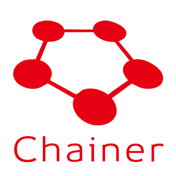
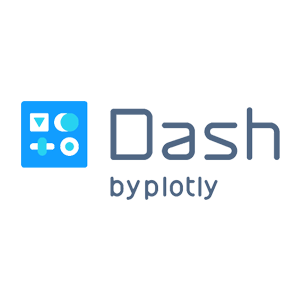

# Google Summer of Code

| [Sub organizations](https://github.com/numfocus/gsoc/tree/update-docs#sub-organizations) | [IDEAS LIST][IL] | [Student guides][CONTRIBUTING]  |

[NumFOCUS][] will be applying again as an umbrella mentoring organization
for [Google Summer of Code 2019][GSoC]. [NumFOCUS][] supports and
promotes world-class, innovative, open source scientific software.

<!--
This Git repository stores information about NumFOCUS' participation in
Google Summer of Code 2019 program and previous editions.
-->

This Git repository stores information about NumFOCUS'
application for Google Summer of Code in the current and previous years.

<!-- markdown-toc start - Don't edit this section. Run M-x markdown-toc-generate-toc again -->
**Table of Contents**

- [Google Summer of Code](#google-summer-of-code)

    - [Students](#students)
    - [Sub Organizations](#sub-organizations)
    - [Organizations Confirmed Under NumFOCUS Umbrella](#organizations-confirmed-under-numfocus-umbrella)
    - [NumFOCUS Projects](#numfocus-projects)
        - [Fiscally Sponsored Projects GSoC Status](#fiscally-sponsored-projects-gsoc-status)
        - [Affiliated Projects GSoC Status](#affiliated-projects-gsoc-status)
        - [Other Projects GSoC Status](#other-projects-gsoc-status)

<!-- markdown-toc end -->

## Students

NumFOCUS is participating as a umbrella organization. This means that
you will need to identify a specific project to apply to under the
NumFOCUS umbrella. (Projects are listed below.)

Read [this document][CONTRIBUTING] to learn how to apply for the
GSoC program with NumFOCUS. Please also check out our [ideas list][IL].

For any questions, please open an issue in our [issue tracker][issues]
or send a email to gsoc@numfocus.org, our mailing list address.
Please also consider subscribing to the mailing list at
https://groups.google.com/a/numfocus.org/forum/#!forum/gsoc.

## Sub Organizations

If you want to participate as a sub organization of NumFOCUS please read
this [guide](CONTRIBUTING-mentors.md).

## Organizations Confirmed Under NumFOCUS Umbrella

<!--
The list should contain for each project.
 - A short description
 - link to their website
 - link to ideas page
 - link how to best contact them
 - link to beginners guide
-->

In alphabetic order.

<table>

  <tr>
    <td>
      
    </td>
    <td>
       <h1>ArviZ</h1>
       

        ArviZ is a Python package for exploratory analysis of Bayesian models. Includes functions for posterior analysis, sample diagnostics, model checking, and comparison. The goal is to provide backend-agnostic tools for diagnostics and visualizations of Bayesian inference in Python, by first converting inference data into xarray objects. 
       

       

         <a href="https://arviz-devs.github.io/arviz/">Website</a> | <a href="https://github.com/arviz-devs/arviz/wiki/GSoC-2019-projects">Ideas List</a> | <a href="https://gitter.im/arviz-devs/community"> Contact (Gitter) </a>
       

    </td>
  </tr>  

  <tr>
    <td>
      
    </td>
    <td>
       <h1>Cantera</h1>
       

        Cantera is a library to solve problems involving thermodynamics, chemical kinetics, and
        transport.
       

       

         <a href="http://cantera.org/">Website</a>  | <a href="https://github.com/Cantera/cantera/wiki/GSoC-2018-Ideas">Ideas List</a> | <a href="https://groups.google.com/forum/#!forum/cantera-users">Mailing List</a>
       

    </td>
  </tr>

  <tr>
    <td>
      
    </td>
    <td>
       <h1>Chainer</h1>
       

        Chainer is a powerful, flexible and intuitive deep learning framework. Chainer supports CUDA computation. It only requires a few lines of code to leverage a GPU. It also runs on multiple GPUs with little effort. Chainer supports various network architectures including feed-forward nets, convnets, recurrent nets and recursive nets. It also supports per-batch architectures. Forward computation can include any control flow statements of Python without lacking the ability of backpropagation. It makes code intuitive and easy to debug. 

       

         <a href="https://chainer.org">Website</a>
       

    </td>
  </tr>

  <tr>
    <td>
      
    </td>
    <td>
       <h1>CuPy</h1>
       

        CuPy is an open-source matrix library accelerated with NVIDIA CUDA. It also uses CUDA-related libraries including cuBLAS, cuDNN, cuRand, cuSolver, cuSPARSE, cuFFT and NCCL to make full use of the GPU architecture. CuPy’s interface is highly compatible with NumPy; in most cases it can be used as a drop-in replacement. All you need to do is just replace numpy with cupy in your Python code. It supports various methods, indexing, data types, broadcasting and more.
       

       

         <a href="https://cupy.chainer.org">Website</a>
       

    </td>
  </tr>

 <!--  <tr>
    <td>
      
    </td>
    <td>
       <h1>Conda Forge</h1>
       

        A community led collection of recipes, build infrastructure and distributions for the conda package manager.
       

       

         <a href="https://conda-forge.github.io/">Website</a>  | <a href="https://gitter.im/conda-forge/conda-forge.github.io">Gitter</a>
       

    </td>
  </tr>
-->

 <tr>
   <td>
     
   </td>
   <td>
      <h1>Dash</h1>
      
Dash is a Python framework for building analytical web applications. No JavaScript required. Built on top of Plotly.js, React, and Flask, Dash ties modern UI elements like dropdowns, sliders, and graphs to your analytical Python code.

      

        <a href="https://dash.plot.ly">Website</a> | <a href="https://github.com/plotly/googleSOC/blob/master/plotly-ideas-list.md">Ideas List</a> | <a href="mailto:jobs@plot.ly?subject=GSOC">Contact</a>
      

   </td>
 </tr>
 <tr>
   <td>
     
   </td>
   <td>
      <h1>Dask</h1>
      
Dask enables parallel computing through task scheduling and blocked algorithms.This allows developers to write complex parallel algorithms and execute them in parallel either on a modern multi-core machine or on a distributed cluster.

      

        <a href="http://dask.pydata.org/en/latest/">Website</a>
      

   </td>
 </tr>

  <tr>
   <td>
     
   </td>
   <td>
      <h1>Data Retriever</h1>
      

        The Data Retriever is a package manager for data. It downloads, cleans,
        and stores publicly available data, so that analysts spend less time
        cleaning and managing data, and more time analyzing it.
      

      

        <a href="http://www.data-retriever.org/">Website</a>  | <a href="https://github.com/weecology/retriever/wiki/GSoC-2019-Project-Ideas"> Ideas List</a> | <a href="https://gitter.im/weecology/retriever"> Contact (Gitter)
      

   </td>
 </tr>

  <tr>
   <td>
     
   </td>
   <td>
      <h1>FEniCS</h1>
      

        FEniCS is an automated finite element library used to solve equations used in
        modeling, featuring a domain-specific language and automated code generation.
        Users input a problem that looks very much like mathematical notation; FEniCS
        then translates that into computer code. It solves problems for which there is
        no analytical (exact) solution numerically.
      

      

        <a href="https://fenicsproject.org/">Website</a> | <a href="https://fenicsproject.org/community/">Community Page With Access to Slack</a> | <a href ="https://github.com/numfocus/gsoc/blob/master/2018/ideas-list-fenics.md"> Ideas Page
      

   </td>
 </tr>
<!-- 
 <tr>
   <td>
     
   </td>
   <td>
      <h1>Gensim</h1>
      
"Topic Modelling for Humans." Gensim is an open-source Python library for topic modelling, document indexing and similarity retrieval with large corpora. Target audience is the natural language processing (NLP) and information retrieval (IR) community. Memory-independent and distributed algorithms.

      

        <a href="https://github.com/RaRe-Technologies/gensim">Website</a>  | <a href="https://github.com/RaRe-Technologies/gensim/wiki/GSOC-2018-project-ideas">Ideas Page</a> | <a href="mailto:student-projects@rare-technologies.com">Mailing List</a>
      

   </td>
 </tr>

  <tr>
   <td>
     
   </td>
   <td>
      <h1>Julia</h1>
      
Julia is a high-level, high-performance dynamic programming language for numerical computing. It provides a sophisticated compiler, distributed parallel execution, numerical accuracy, and an extensive mathematical function library. Julia’s Base library, largely written in Julia itself, also integrates mature, best-of-breed open source C and Fortran libraries for linear algebra, random number generation, signal processing, and string processing. 

      

        <a href="https://julialang.org/">Website</a>  | <a href="https://julialang.org/soc/ideas-page.html">Ideas Page</a> | <a href="https://discourse.julialang.org/">discourse</a>
      

   </td>
 </tr>
-->
   <tr>
   <td>
     
   </td>
   <td>
      <h1>JuMP</h1>
      
JuMP is a modeling interface and a collection of supporting packages for mathematical optimization that is embedded in Julia. With JuMP, users formulate various classes of optimization problems with easy-to-read code, and then solve these problems using state-of-the-art open-source and commercial solvers. JuMP also makes advanced optimization techniques easily accessible from a high-level language. 

      

        <a href="http://www.juliaopt.org">Website</a> 
      

   </td>
 </tr>
  <tr>
    <td>
      
    </td>
    <td>
       <h1>MDAnalysis</h1>
       
MDAnalysis is a Python library to analyze trajectories from molecular dynamics (MD) simulations in many popular formats

       

         <a href="https://www.mdanalysis.org/">Website</a> | <a href="https://groups.google.com/forum/#!forum/mdnalysis-devel">Mailing list</a> | <a href="https://github.com/MDAnalysis/mdanalysis/wiki/GSoC-2019-Project-Ideas">Ideas List</a>
       

    </td>
  </tr>
 <tr>
   <td>
     
   </td>
   <td>
      <h1>nteract</h1>
      
nteract is a stand-alone desktop application for developing computational notebooks. nteract allows users to craft narratives involving text, code, images, and data on the desktop rather than through a web application. This enables users to use their native system for file search as well as clicking to open notebook files.

      

        <a href="https://nteract.io/">Website</a>
      

   </td>
 </tr>
  <tr>
    <td>
      
    </td>
    <td>
       <h1>PyMC3</h1>
       
PyMC3 is a python module for Bayesian statistical modeling and model fitting which focuses on advanced Markov chain Monte Carlo and variational fitting algorithms. Its flexibility and extensibility make it applicable to a large suite of problems.

       

         <a href="https://pymc-devs.github.io/pymc3/">Website</a> | <a href="https://discourse.pymc.io/">discourse</a> | <a href="https://github.com/pymc-devs/pymc3/wiki/GSoC-2019-projects">Ideas Page</a>
       

    </td>
  </tr>

  <tr>
    <td>
      
    </td>
    <td>
       <h1>QuTiP</h1>
       
QuTiP is a software for simulating quantum systems. QuTiP aims to provide tools for user-friendly and efficient numerical simulations of open quantum systems. It can be used to simulate a wide range of physical phenomenon in areas such as quantum optics, trapped ions, superconducting circuits and quantum nanomechanical resonators. In addition, it contains a number of other modules to simplify the numerical simulation and study of many topics in quantum physics such as quantum optimal control, quantum information, and computing.

       

         <a href="http://qutip.org">Website</a> |  <a href="https://github.com/qutip/qutip/wiki/Google-Summer-of-Code-2019">Ideas Page</a>
       

    </td>
  </tr>

  <tr>
    <td>
      
    </td>
    <td>
       <h1>Spyder</h1>
       
Spyder is a powerful scientific environment written in Python, for Python, and designed by and for scientists, engineers and data analysts. It features a unique combination of the advanced editing, analysis, debugging, and profiling functionality of a comprehensive development tool with the data exploration, interactive execution, deep inspection, and beautiful visualization capabilities of a scientific package. Furthermore, Spyder offers built-in integration with many popular scientific packages, including NumPy, SciPy, Pandas, IPython, QtConsole, Matplotlib, SymPy and more.

       

         <a href="https://www.spyder-ide.org">Website</a>
       

    </td>
  </tr>
<!-- 
  <tr>
    <td>
      
    </td>
    <td>
       <h1>Stan</h1>
       
Stan is a probabilistic programming language for data analysis, enabling automatic inference for a large class of statistical models. It features full Bayesian inference with Markov chain Monte Carlo sampling, approximate Bayesian inference with variational inference and the Laplace approximation, and penalized maximum likelihood estimation with optimization. The language integrates a Math Library written in C++, which can act as a stand-alone, and features derivatives for arithmetic, special functions, probability functions, and linear algebra.

       

         <a href="http://mc-stan.org/">Website</a> | <a href="http://discourse.mc-stan.org">Mailing List</a> | <a href="https://github.com/numfocus/gsoc/blob/master/2018/ideas-list-stan.md">Ideas Page</a>
       

    </td>
  </tr>

<tr>
   <td>
     
   </td>
   <td>
      <h1>Shogun</h1>
      
Shogun is and open-source machine learning library that offers a wide range of efficient and unified machine learning methods.

      

        <a href="http://shogun.ml/">Website</a> | <a href="https://github.com/shogun-toolbox/shogun/wiki/Google-Summer-of-Code-2018-Projects">Ideas Page</a> | <a href="https://gitter.im/shogun-toolbox/shogun">Gitter</a>
      

   </td>
 </tr>
-->

 <tr>
   <td>
     
   </td>
   <td>
      <h1>Yellowbrick</h1>
      
Yellowbrick is a Python package that visualizes the data science workflow, allowing users to visually steer the feature, algorithm, and hyperparameter selection process by directly extending the Scikit-Learn API.

      

        <a href="http://www.scikit-yb.org/en/latest/">Website</a>
      

   </td>
 </tr>

<!--
 <tr>
   <td>
     
   </td>
   <td>
      <h1>yt</h1>
      
yt is a community-developed analysis and visualization toolkit for examining datasets in a variety of scientific disciplines. yt aims to provide a simple uniform way of handling volumetric data, regardless of where it is generated. yt is developed in Python under the open-source model.

      

        <a href="http://yt-project.org/">Website</a> | <a href="https://github.com/yt-project/gsoc-2018">Ideas Page</a> | <a href="http://yt-project.org/community.html">community-page</a> | <a href="https://mail.python.org/mm3/mailman3/lists/yt-dev.python.org/">mailing-list </a>
      

   </td>
 </tr>
 -->
</table>

## NumFOCUS Organizations

Not all NumFOCUS organizations participate under our umbrella. These lists show
which organizations are participating with GSoC and where you can find
information how to work with them.

### Fiscally Sponsored Organizations GSoC Status

| Project                         | Status                           | Ideas Pages                                         |
| -------                         | ------                           | -----------                                         |
| [AstroPy]                       | Unknown     |    |
| [Cantera]                       | Applying under NumFOCUS umbrella | https://github.com/Cantera/cantera/wiki/GSoC-2019-Ideas                                                |
| [Econ-ARK][Econ-ARK]            | Unknown                |                                                     |
| [FEniCS Project][FEniCSproject] | Applying under NumFOCUS umbrella |                                                     |
| [IPython]                       | Unknown                          |                                                     |
| [Julia]                         | Unknown |           |
| [JuMP]                          | Applying under NumFOCUS umbrella |                                                     |
| [Matplotlib]                    | Unknown                          |                                                     |
| [nteract]                       | Applying under NumFOCUS umbrella                          |                                                     |
| [NumPy]                         | Unknown                |                                                     |
| [Open Journals][theoj]          | Unknown                          |                                                     |
| [Project Jupyter][Jupyter]      | Unknown                          |                                                     |
| [pandas]                        | Unknown                          |                                                     |
| [PyMC3](pymc3)                  | Applying under NumFOCUS umbrella | https://github.com/pymc-devs/pymc3/wiki/GSoC-2019-projects |
| [PyTables]                      | Unknown                          |                                                     |
| [QuantEcon]                     | Unknown                          |                                                     |
| [rOpenSci]                      | Unknown                |                                                     |
| [Shogun]                        | Unknown |                                                    |
| [SunPy]                         | Unknown |  |
| [SymPy]                         | Unknown |  |
| [Stan]                          | Unknown |                                                     |
| [yt]                            | Unknown |                                                     |

### Affiliated Organizations GSoC Status

| Project              | Status                           | Ideas Pages |
| -------              | ------                           | ----------- |
| [ArviZ]              | Applying under NumFOCUS umbrella |             |
| [Bokeh]              | Unknown                          |             |
| [Chainer]            | Applying under NumFOCUS umbrella |             |
| [Conda]              | Unknown                          |             |
| [conda-forge]        | Unknown                          |             |
| [CuPy]               | Applying under NumFOCUS umbrella |             |
| [Cython]             | Unknown                          |             |
| [Dash]               | Applying under NumFOCUS umbrella |             |
| [Data Retriever][DR] | Applying under NumFOCUS umbrella |             |
| [Dask]               | Applying under NumFOCUS umbrella |             |
| [DyND]               | Unknown                          |             |
| [Gensim]             | Unknown                          |             |
| [MDAnalysis]         | Applying under NumFOCUS umbrella | https://github.com/MDAnalysis/mdanalysis/wiki/GSoC-2019-Project-Ideas |
| [Numba]              | Unknown                          |             |
| [Orange]             | Unknown                          |             |
| [Pomegranate]        | Unknown                          |             |
| [PythonXY]           | Unknown                          |             |
| [QuTiP]              | Applying under NumFOCUS umbrella |             |
| [SciPy]              | Unknown                          |             |
| [scikit-image]       | Unknown                          |             |
| [scikit-bio]         | Unknown                          |             |
| [scikit-learn]       | Unknown                          |             |
| [Statmodels]         | Unknown                          |             |
| [Spack]              | Unknown                          |             |
| [Spyder]             | Applying under NumFOCUS umbrella |             |
| [Theano]             | Unknown                          |             |
| [xarray]             | Unknown                          |             |
| [Yellowbrick]        | Applying under NumFOCUS umbrella |             |

[ArviZ]: https://arviz-devs.github.io/arviz/
[AstroPy]: http://www.astropy.org/
[Bokeh]: http://bokeh.pydata.org/
[cantera]:  http://cantera.org/docs/sphinx/html/index.html
[Chainer]: http://chainer.org
[CONTRIBUTING]: CONTRIBUTING-students.md
[Conda]: https://github.com/conda/conda
[conda-forge]: https://conda-forge.org
[CuPy]: http://cupy.chainer.org
[Cython]: http://cython.org/
[CF]: https://conda-forge.github.io/
[Dash]: https://plot.ly/dash/
[Dask]: http://dask.pydata.org/
[DR]: http://www.data-retriever.org/
[DyND]: http://libdynd.org/
[Econ-ARK]: https://econ-ark.github.io/HARK/
[FEniCSproject]: https://fenicsproject.org/
[Gensim]: https://radimrehurek.com/gensim/
[GSoC]: https://summerofcode.withgoogle.com/
[IL]: 2019/ideas-list.md
[IPython]: http://ipython.org/
[issues]: https://github.com/numfocus/gsoc/issues
[Julia]: http://julialang.org/
[JuMP]: http://www.juliaopt.org
[Jupyter]: http://jupyter.org/
[Matplotlib]: http://matplotlib.sourceforge.net/
[MDAnalysis]: http://mdanalysis.org
[Numba]: http://numba.pydata.org/
[NumFOCUS-Projects]: http://numfocus.org/projects/index.html
[NumFOCUS]: http://numfocus.org/
[NumPy]: http://numpy.scipy.org/
[nteract]: https://nteract.io/
[theoj]: http://www.theoj.org
[Orange]: http://orange.biolab.si/
[pandas]: http://pandas.pydata.org/
[Pomegranate]: https://pomegranate.readthedocs.io/en/latest/
[PyTables]: http://pytables.github.com/
[PythonXY]: http://code.google.com/p/pythonxy/wiki/Welcome
[QuTiP]: https://qutip.org
[rOpenSci]: http://ropensci.org/
[quantecon]: http://quantecon.org/
[SCF]: http://software-carpentry.org/scf/index.html
[scikit-bio]: http://scikit-bio.org/
[scikit-image]: http://scikit-image.org/
[scikit-learn]: http://scikit-learn.org/stable/
[SciPy]: http://www.scipy.org/
[Spack]: https://spack.io
[Spyder]: https://www.spyder-ide.org/
[Statmodels]: http://statsmodels.sourceforge.net/
[Stan]: http://mc-stan.org/
[Shogun]: http://www.shogun-toolbox.org
[SunPy]: http://sunpy.org
[SymPy]: http://sympy.org
[Theano]: http://deeplearning.net/software/theano/
[xarray]: http://xarray.pydata.org/
[Yellowbrick]: http://www.scikit-yb.org/en/latest/
[yt]: http://yt-project.org/
