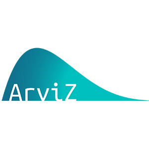
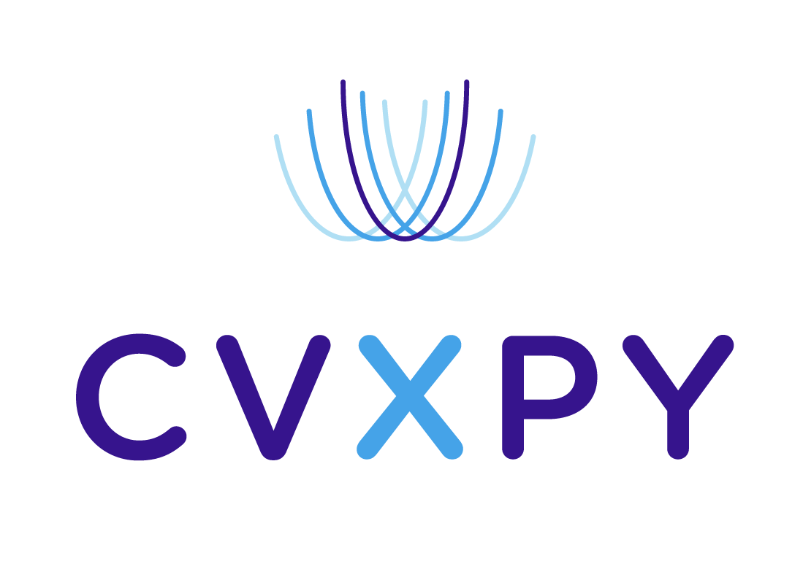
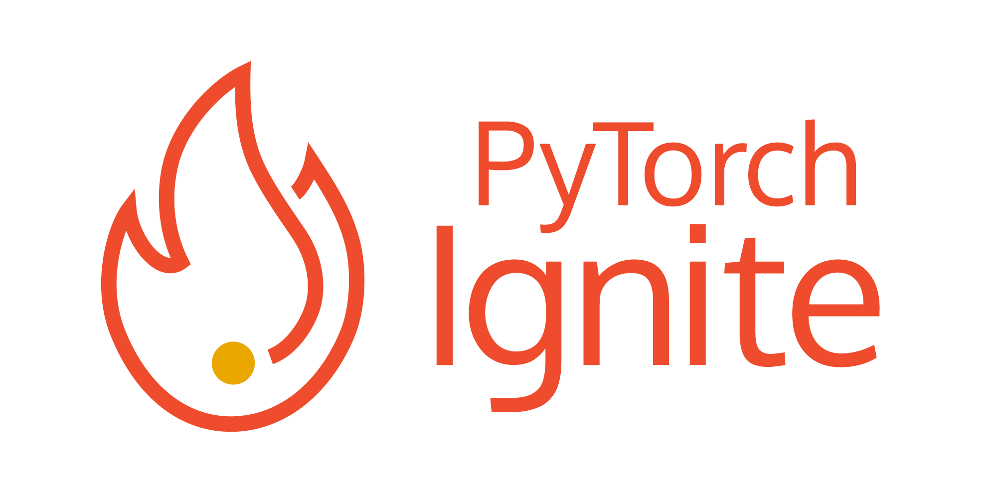
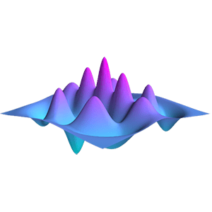

# Google Summer of Code

| [Sub organizations](#sub-organizations) | [IDEAS LIST][IL] | [Contributor guides][CONTRIBUTING]  |

[NumFOCUS][] will be applying again as an umbrella mentoring organization
for [Google Summer of Code 2026][GSoC]. [NumFOCUS][] supports and
promotes world-class, innovative, open source scientific software.

[NumFOCUS][] is committed to promoting and sustaining a professional and ethical community. Our [Code of Conduct](https://numfocus.org/code-of-conduct) is our effort to uphold these values and it provides a guideline and some of the tools and resources necessary to achieve this.

[Google Summer of Code][GSoC] is an annual open source internship program
sponsored by Google. This repository contains information specific to NumFOCUS'
participation in GSoC. For general information about the competition, including
this year's application timeline and key phases involved, please see the [GSoC
website](https://summerofcode.withgoogle.com/how-it-works/)

<!--
This Git repository stores information about NumFOCUS' participation in
Google Summer of Code program.
-->

This Git repository stores information about NumFOCUS'
application for Google Summer of Code in the current and previous years.

<!-- markdown-toc start - Don't edit this section. Run M-x markdown-toc-generate-toc again -->
**Table of Contents**

- [Google Summer of Code](#google-summer-of-code)
  - [Contributor](#contributor)
  - [AI Guidelines](#ai-guidelines)
  - [Sub Organizations](#sub-organizations)
  - [Organizations Confirmed Under NumFOCUS Umbrella](#organizations-confirmed-under-numfocus-umbrella)
<!-- markdown-toc end -->

## Contributor

NumFOCUS is participating as a umbrella organization. This means that
you will need to identify a specific project to apply to under the
NumFOCUS umbrella. (Projects are listed below.)

Read [this document][CONTRIBUTING] to learn how to apply for the
GSoC program with NumFOCUS. Please also check out our [ideas list][IL].

For project-specific questions, contact the project directly.
Every project has a Code of Conduct and a contributing guide,
please read these before opening an issue about getting started with GSoC.
GSoC is hands-on: rather than sending introductory emails, begin by triaging or solving issues to get to know the team.

For general questions, open an issue in our [issue tracker][issues] or email gsoc@numfocus.org.
You can also subscribe to the mailing list at https://groups.google.com/a/numfocus.org/forum/#!forum/gsoc.

## AI Guidelines

At the organization level, contributors must clearly cite any AI tools used.
AI use is generally acceptable but determined by each sub-organization/project;
verify the project's AI acceptance and guidelines before using AI.
Please read Google's [Guidance for GSoC Contributors using AI tooling in GSoC 2026][AIGUIDE].

## Sub Organizations

If you want to participate as a sub organization of NumFOCUS please read
this [guide](CONTRIBUTING-mentors.md).

## Organizations Confirmed Under NumFOCUS Umbrella

<!--
The list should contain for each project.
- A short description
- link to their website
- link to ideas page
- link how to best contact them
- link to beginners guide
-->

In alphabetic order.

<table>
  <tr>
    <td>
      
    </td>
    <td>
       <h1>AiiDA</h1>
       

          AiiDA is a python framework for managing computational science workflows, with roots in computational materials science. It helps researchers manage large numbers of simulations (10k, 100k, 1M, ...) and complex workflows involving multiple executables. At the same time, it records the provenance of the entire simulation pipeline with the aim to make it fully reproducible.
       

       

       <a href="https://www.aiida.net/">Website</a> | <a href="https://github.com/aiidateam/aiida-core/wiki/GSoC-2026-Projects">Ideas List</a> | <a href="https://aiida.discourse.group/">Discourse</a> | <a href="https://github.com/aiidateam/aiida-core">Source Code</a>
       

    </td>
  </tr>

  <tr>
    <td>
      
    </td>
    <td>
       <h1>ArviZ</h1>
       

        ArviZ is a project dedicated to promoting and building tools for exploratory analysis of Bayesian models. It currently has a Python and a Julia interface. ArviZ aims to integrate seamlessly with established probabilistic programming languages like PyStan, PyMC, Turing, Soss, emcee, or Pyro. Where the probabilistic programming languages aim to make it easy to build and solve Bayesian models, the ArviZ libraries aim to make it easy to process and analyze the results from those Bayesian models.
       

       

         <a href="https://python.arviz.org/en/latest/">Website</a> | <a href="https://github.com/arviz-devs/arviz/wiki/GSoC-2026-projects">Ideas List</a> | <a href="https://github.com/arviz-devs/arviz/discussions/categories/general"> Contact (GH Discussions) </a> | <a href="https://github.com/arviz-devs">Source Code</a>
       

    </td>
  </tr>

  <tr>
    <td>
      
    </td>
    <td>
       <h1>CVXPY</h1>
       

         CVXPY is an open source Python-embedded modeling language for convex optimization problems. It lets you express your problem in a natural way that follows the math, rather than in the restrictive standard form required by solvers.
       

       

         <a href="https://www.cvxpy.org/">Website</a> | <a href="https://github.com/cvxpy/GSOC">Ideas List</a> | <a href="https://github.com/cvxpy/cvxpy/discussions">Discussions</a> | <a href="https://github.com/cvxpy/cvxpy">Source Code</a>
       

    </td>
  </tr>

  <tr>
   <td>
     
   </td>
   <td>
      <h1>Data Retriever</h1>
      

        The Data Retriever ecosystem improves reproducible research through data product management. The platform takes advantage of freely available data sources in a variety of formats, standardizes them, and makes them available to scientists in a form that is ready to analyze. Data sources range from tabular data, spatial data packages and APIs. Several data packages use the ecosystems, and many projects support or rely on the ecosystem.
      

      

        <a href="http://www.data-retriever.org/">Website</a>  | <a href="https://github.com/weecology/retriever/wiki/GSoC-2026-Project-Ideas"> Ideas List</a> | <a href="https://gitter.im/weecology/retriever"> Contact (Gitter) </a> | <a href="https://github.com/weecology/retriever">Source Code</a>
      

   </td>
  </tr>

  <tr>
   <td>
      
   </td>
   <td>
      <h1>Gammapy</h1>
      

        Gammapy is a community-developed, open-source Python package for gamma-ray astronomy built on Numpy, Scipy and Astropy. It is the core library for the CTAO Science Tools but can also be used to analyse data from existing imaging atmospheric Cherenkov telescopes (IACTs), such as H.E.S.S., MAGIC and VERITAS. It also provides some support for Fermi-LAT and HAWC data analysis..
      

      

        <a href="https://gammapy.org/">Website</a>  | <a href="https://github.com/gammapy/gammapy/wiki/GSoC-2026-Project"> Ideas List</a> | <a href="gammapy-ld-l@in2p3.fr"> General contact </a> | <a href="https://github.com/gammapy/gammapy">Source Code</a>
      

   </td>
  </tr>

  <tr>
    <td>
      
    </td>
    <td>
      <h1>GRASS</h1>
      

        GRASS is a powerful computational engine for raster, vector, and geospatial processing. It supports terrain and ecosystem modeling, hydrology, data management, and imagery processing. With a built-in temporal framework and Python API, it enables advanced time series analysis and rapid geospatial programming, optimized for large-scale analysis on various hardware configurations. GRASS provides a curated repository of contributed tools that continue to be maintained and enhanced as research and technology evolves.
      

      

        <a href="https://grass.osgeo.org">Website</a> | <a href="https://grasswiki.osgeo.org/wiki/GRASS_GSoC_Ideas_2026">Ideas List</a> | <a href="https://discourse.osgeo.org/c/grass/developer/61"> Contact </a> | <a href="https://github.com/OSGeo/grass">Source Code</a>
      

    </td>
  </tr>

  <tr>
    <td>
      
    </td>
    <td>
      <h1>Gridap</h1>
      

        Gridap is a new generation, open-source, finite element (FE) library implemented in the Julia programming language. Gridap aims at adopting a more modern programming style than existing FE applications written in C/C++ or Fortran.
      

      

        <a href="https://gridap.github.io/Tutorials/stable/">Website</a>  | <a href="https://github.com/gridap/GSoC/blob/main/2026/ideas-list.md"> Ideas List</a> | <a href="https://gitter.im/Gridap-jl/community"> Contact (Gitter) </a> | <a href="https://github.com/gridap/Gridap.jl">Source Code</a>
      

    </td>
  </tr>

  <tr>
    <td>
      
    </td>
    <td>
      <h1>HoloViz</h1>
      

        HoloViz is an open-source Python ecosystem for creating interactive visualizations and data applications with minimal code and no required JavaScript. It connects tools like Panel, HoloViews, hvPlot, Datashader, and Bokeh so data scientists can move smoothly from exploration in a notebook to full web dashboards using the same declarative workflow. HoloViz emphasizes scalability for large datasets, rich interactivity such as linked plots and widgets, and easy deployment to standalone apps or cloud services—all while keeping the focus on simple, Python-first development.
      

      

        <a href="https://holoviz.org">Website</a> | <a href="https://github.com/holoviz/holoviz/wiki/2026-GSoC-Project-List">Ideas List</a> | <a href="https://holoviz.org/community.html"> Contact </a> | <a href="https://github.com/holoviz/">Source Code</a>
      

    </td>
  </tr>

  <tr>
    <td>
      
    </td>
    <td>
      <h1>JuMP</h1>
      

        JuMP is a modeling language and collection of supporting packages for mathematical optimization in Julia. JuMP makes it easy to formulate and solve a range of problem classes, including linear programs, integer programs, conic programs, semidefinite programs, and constrained nonlinear programs.
      

      

        <a href="https://jump.dev">Website</a> | <a href="https://github.com/jump-dev/GSOC">Ideas List</a> | <a href="https://app.slack.com/client/T68168MUP/C055CQDPKLL"> Contact </a> | <a href="https://github.com/jump-dev">Source Code</a>
      

    </td>
  </tr>

  <tr>
    <td>
      
    </td>
    <td>
       <h1>Matplotlib</h1>
       

         Matplotlib is a comprehensive library for creating static, animated, and interactive visualizations in Python. Matplotlib makes easy things easy and hard things possible.
       

       

       <a href="https://matplotlib.org">Website</a> | <a href="https://github.com/matplotlib/matplotlib/wiki/Matplotlib-GSoC-2024-Ideas">Ideas List</a> | <a href="https://gitter.im/matplotlib/matplotlib">Gitter</a> | <a href="https://github.com/matplotlib/matplotlib">Source Code</a>
       

    </td>
  </tr>

  <tr>
    <td>
      
    </td>
    <td>
       <h1>pvlib</h1>
       
pvlib python is a community developed toolbox that provides a set of functions and classes for simulating the performance of photovoltaic energy systems and accomplishing related tasks. The core mission of pvlib python is to provide open, reliable, interoperable, and benchmark implementations of PV system models.

       

         <a href="https://pvlib-python.readthedocs.io/en/stable/">Website</a> | <a href="https://groups.google.com/forum/#!forum/pvlib-python">Google Group Forum</a> | <a href="https://github.com/pvlib/pvlib-python/wiki/GSoC-2026-Projects">Ideas Page</a> | <a href="https://github.com/pvlib/pvlib-python"> Source Code</a>
       

    </td>
  </tr>

  <tr>
    <td>
      
    </td>
    <td>
       <h1>PyMC</h1>
       
PyMC is a python module for Bayesian statistical modeling and model fitting which focuses on advanced Markov chain Monte Carlo and variational fitting algorithms. Its flexibility and extensibility make it applicable to a large suite of problems.

       

         <a href="https://www.pymc.io/welcome.html">Website</a> | <a href="https://discourse.pymc.io/">discourse</a> | <a href="https://github.com/pymc-devs/pymc/wiki/GSoC-2026-projects">Ideas Page</a> | <a href="https://github.com/pymc-devs/pymc"> Source Code</a>
       

    </td>
  </tr>

  <tr>
    <td>
      
    </td>
    <td>
       <h1>PySAL</h1>
       
PySAL is a python library for geographical data science. It consists of 18 subpackages that cover a wide range of spatial analytical methods from exploratory spatial data analysis, spatial interaction modeling, spatial optimization, spatial econometrics, segregation, and spatial interpolation, among others.

       

       <a href="https://pysal.org">Website</a> | <a href="https://discord.gg/BxFTEPFFZn">Discord</a> | <a href="https://github.com/pysal/pysal/wiki/Google-Summer-of-Code-2026">Ideas Page</a> | <a href="https://github.com/pysal/pysal"> Source Code</a> 

    </td>
  </tr>

  <tr>
    <td>
      
    </td>
    <td>
       <h1>PyTorch-Ignite</h1>
       
PyTorch-Ignite is a high-level library to help with training neural networks in PyTorch

       

         <a href="https://pytorch-ignite.ai/">Website</a> | <a href="https://pytorch-ignite.ai/chat/">Discord</a> | <a href="https://github.com/pytorch/ignite/discussions">GitHub Discussions</a> | <a href="https://github.com/pytorch/ignite/wiki/GSoC-2026-project-idea">Ideas Page</a> | <a href="https://github.com/pytorch/ignite"> Source Code</a>
       

    </td>
  </tr>

  <tr>
    <td>
      
    </td>
    <td>
       <h1>QuTiP</h1>
       
 QuTiP is a software for simulating quantum systems. QuTiP aims to provide tools for user-friendly and efficient numerical simulations of open quantum systems. It can be used to simulate a wide range of physical phenomenon in areas such as quantum optics, trapped ions, superconducting circuits and quantum nanomechanical resonators. In addition, it contains a number of other modules to simplify the numerical simulation and study of many topics in quantum physics such as quantum optimal control, quantum information, and computing. 

       

         <a href="http://qutip.org">Website</a> | <a href="http://groups.google.com/group/qutip"> Contact </a> | <a href="https://github.com/qutip/qutip/wiki/Google-Summer-of-Code-current">Ideas Page</a> | <a href="https://github.com/qutip/qutip"> Source Code</a>
       

    </td>
  </tr>

  <tr>
    <td>
      
    </td>
    <td>
       <h1>sbi</h1>
       
sbi (simulation-based inference) is a Python package for performing Bayesian inference on complex, simulator-defined models, where the likelihood function is intractable.  It leverages the simulator directly, using modern probabilistic machine learning methods like normalizing flows and neural posterior estimation. sbi is built on PyTorch and is designed for both research and application.

       

         <a href="https://sbi-dev.github.io/sbi/latest/">Website</a> | <a href="https://github.com/sbi-dev/sbi/discussions/1318">Discord</a> | <a href="https://github.com/sbi-dev/sbi/wiki/GSoC_2025_Projects">Ideas Page</a> | <a href="https://github.com/sbi-dev/sbi">Source Code</a>
       

    </td>
  </tr>

  <tr>
    <td>
      
    </td>
    <td>
       <h1>scikit-bio</h1>
       
Scikit-bio is an open-source Python library for bioinformatics, providing versatile data structures, algorithms and educational resources. It features a comprehensive suite of tools for biological "omics" data analysis, including the processing and analysis of high-dimensional, sparse and knowledge graph-organized data.

       

         <a href="https://scikit.bio/">Website</a> | <a href="https://github.com/scikit-bio/scikit-bio/wiki/GSOC-2026-project-ideas">Ideas Page</a> | <a href="https://scikit.bio/contribute.html">Contribution Guide</a> | <a href="https://github.com/scikit-bio/scikit-bio"> Source Code</a>
       

    </td>
  </tr>

  <tr>
    <td>
       
    </td>
    <td>
       <h1>SciML</h1>
       
 SciML is an open source software organization created to unify the packages for scientific machine learning. This includes the development of modular scientific simulation support software, such as differential equation solvers, along with the methodologies for inverse problems and automated model discovery. By providing a diverse set of tools with a common interface, we provide a modular, easily-extendable, and highly performant ecosystem for handling a wide variety of scientific simulations. 

       

         <a href="http://sciml.ai">Website</a> | <a href=https://julialang.zulipchat.com/#narrow/stream/279055-sciml-bridged"> Contact </a> | <a href="https://sciml.ai/dev/#google_summer_of_code">Ideas Page</a> | <a href="https://github.com/SciML/"> Source Code</a>
       

    </td>
  </tr>

  <tr>
    <td>
      
    </td>
    <td>
       <h1>Stan</h1>
       
 Software for Bayesian Data Analysis. Stan combines a probabilistic programming language,  written in OCaml, with a collection of inference algorithms, written in C++, and interfaces for Python, Julia, and R. Stan's probabilistic programming language is suitable for a wide range of applications, from simple linear regression to multi-level models and time-series analysis. The Stan ecosystem of tools for validation and visualization facilitates decision-making and communication.  

       

         <a href="https://mc-stan.org">Website</a> | <a href="https://github.com/stan-dev/stan/issues">Contact</a> | <a href="https://github.com/stan-dev/stan/wiki/GSOC-2026-Proposed-Projects">Ideas Page</a> | <a href="https://github.com/stan-dev"> Source Code</a>
       

    </td>
  </tr>

  <tr>
    <td>
      
    </td>
    <td>
       <h1>toqito</h1>
       
The toqito package is an open source library for studying various objects in quantum information, namely, states, channels, and measurements. toqito focuses on providing numerical tools to study problems pertaining to entanglement theory, nonlocal games, and other aspects of quantum information that are often associated with computer science. 

       

         <a href="https://toqito.readthedocs.io/en/latest/">Website</a> |  <a href="https://discord.gg/eNmfDMGk">Discord</a> | <a href="https://github.com/vprusso/toqito/wiki/GSoC-2026-Projects">Ideas Page</a> | <a href="https://github.com/vprusso/toqito"> Source Code</a>
       

    </td>
  </tr>
</table>

[ArviZ]: https://www.arviz.org
[AstroPy]: https://www.astropy.org/
[AIGUIDE]: https://docs.google.com/document/d/1t9GcIBnNXPNO6klRQvU8pL8-uV6afzLo6JUAM299suA/edit?tab=t.0#heading=h.tgbr0z4x9eg5
[Blosc]: https://www.blosc.org/
[Bokeh]: https://docs.bokeh.org/en/latest/
[cantera]: https://cantera.org/index.html
[Chainer]: https://chainer.org/
[Clawpack]: https://www.clawpack.org/
[CONTRIBUTING]: CONTRIBUTING-contributors.md
[Conda]: https://github.com/conda/conda
[conda-forge]: https://conda-forge.org
[Colour]: https://www.colour-science.org/
[CuPy]: https://cupy.dev/
[Cython]: https://cython.org/
[CF]: https://conda-forge.github.io/
[Dash]: https://plot.ly/dash/
[Dask]: https://dask.org/
[DR]: https://www.data-retriever.org/
[DyND]: http://libdynd.org/
[Econ-ARK]: https://econ-ark.github.io/HARK/
[equadratures]: https://equadratures.org/
[FEniCSproject]: https://fenicsproject.org/
[FluxML]: https://fluxml.ai
[GRASS]: https://grass.osgeo.org
[Gensim]: https://radimrehurek.com/gensim/
[GSoC]: https://summerofcode.withgoogle.com/
[IL]: 2026/ideas-list.md
[IPython]: https://ipython.org/
[issues]: https://github.com/numfocus/gsoc/issues
[Julia]: https://julialang.org/
[JuMP]: https://jump.dev/
[Jupyter]: https://jupyter.org/
[JupyterLab]: https://jupyterlab.readthedocs.io/en/latest/
[Matplotlib]: https://matplotlib.org/
[MDAnalysis]: https://www.mdanalysis.org/
[NetworkX]: http://networkx.org/
[Numba]: http://numba.pydata.org/
[NumFOCUS-Projects]: https://numfocus.org/sponsored-projects
[NumFOCUS]: https://numfocus.org/
[NumPy]: https://numpy.org/
[nteract]: https://nteract.io/
[theoj]: http://www.theoj.org
[Optuna]: https://optuna.org
[Orange]: http://orange.biolab.si/
[pandas]: https://pandas.pydata.org/
[Pomegranate]: https://pomegranate.readthedocs.io/en/latest/
[pvlib]: https://pvlib-python.readthedocs.io/en/stable/
[PyMC]: https://www.pymc.io
[PySAL]: https://pysal.org/pysal
[PyTables]: http://pytables.github.com/
[PythonXY]: http://python-xy.github.io/
[PyTorch-Ignite]: https://pytorch-ignite.ai/
[QuTiP]: http://qutip.org/
[rOpenSci]: https://ropensci.org/
[quantecon]: https://quantecon.org/
[SCF]: https://carpentries.org/
[scikit-bio]: https://scikit.bio/
[scikit-image]: https://scikit-image.org/
[scikit-learn]: https://scikit-learn.org/stable/
[SciPy]: https://www.scipy.org/
[signac]: https://signac.io
[Spack]: https://spack.io
[Spyder]: https://www.spyder-ide.org/
[Statmodels]: http://www.statsmodels.org/stable/index.html
[Stan]: https://mc-stan.org/
[Shogun]: https://www.shogun-toolbox.org/
[SunPy]: https://sunpy.org/
[SymPy]: https://www.sympy.org/
[Theano]: http://deeplearning.net/software/theano/
[TNL]: https://tnl-project.org/
[xarray]: http://xarray.pydata.org/
[Yellowbrick]: http://www.scikit-yb.org/en/latest/
[yt]: https://yt-project.org/
[Zarr]: https://zarr.dev/
